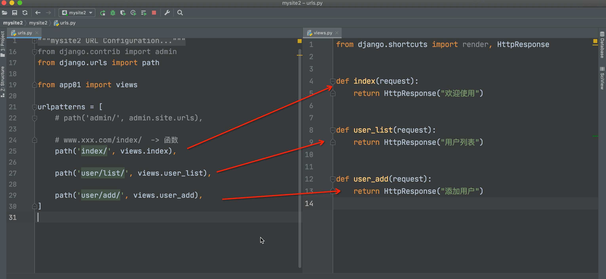

# web开发学习

## Html + Css + Js

## Day 1

### Html

1. Html标签

    ```html
    1. div / span
    2. a / img
    3. ul/ol li  <!--ul无序 ol有序 -->
    4. table thead tr th tbody tr td
    5. h1 / h2 /...
    6. <input type="...">
    7. form表单
    ```

2. 简易spark框架运行web

    ```python
    from flask import Flask,render_template
    app = Flask(__name__)

    @app.route("/show/info")
    def show_info():
        return render_template("1.html")  
        #templates由flask函数中template_folder定义，默认为template_folder=templates
    if __name__ == '__main__':
        app.run()    #run可以定义host和port
    ```

3. input中button和submit的区别

```html
   <input type="button">
   <input type="submit">
```

## Day 2

### 1.CSS三种嵌套进html方式

1. 在html页面head中嵌套style

   ```html
    <head>
        <style>
        ...
        </style>
    </head> 
   ```

2. 直接在html语句中加

   ```html
    <div style="xxx">
   ```

3. .css文件加载进html页面

   ```html
   <link rel="stylesheet"href="/static/commons.css"> 
   <!--在项目中最好创建一个static文件夹，再在其中创建css文件夹,在css文件夹中写css文件-->
   ```

### 2.GET POST请求(request.method)

1. get请求返回string，数据直接反映在url中  
2. post请求返回一个数据结构(*忘*)，不反映在url中

   ```html
   <form method="post" action="/login"> <-!method注明请求类别 action为url-->
    <div>
        用户名:<input type="text" name="user"/>
        密码:<input type="password" name="pwd"/>
    </div>
        <input type="submit" value="提交">
    </form>
   ```

   ```python
   print(request.form) #查看post返回值
   print(request.form.get("name")) #查看具体值name
   ```

3. get支持两种返回值 post只支持一种(*忘*)
   作用：用来区别...(*忘*)

   ```python
   @app.route('/login',methods=['GET','POST'])
    def login():
    if (request.method == 'GET'):
        return render_template("login.html")
    else:
        print(request.form)
        return "登录成功"
    ```

### 3.CSS

1. 选择器(一般写在```html <style>```中 类似C的函数 有继承的思想)
    1. ID选择器

        ```HTML
        #c1 {
        color: red;
        }
        <div id='c1'></div>
        ```

    2. 类~

        ```html
        .c1 {
        color: red;
        }
        <div class='c1'></div>
        ```

    3. 标签~

        ```html
        div {
            color:red;
        }
        <div>xxx</div> <-!xxx会变红-->
        ```

    4. 后代~(后缀作用)

        ```html
        <head>
        <style>
            .zz h2{
            color:chartreuse;
            }
        </style>
        </head>
        <body>
            <div class="zz" >
                <div>
                    <h2>我是div里面的h2</h2>
                </div>
                <h2>我是div外面的h2</h2>
        </body>
        ```

        上例中两个h2都会生效，若只想第一层的生效，需如此定义:

        ```html
        <style>
            .zz > h2{
                color:chartreuse;
            }
        </style>
        ```

    5. 属性~(后缀作用)
        以[]加在上面几种选择器后面中,达到选择某一个的作用  

        eg1:

        ```html
        input[type="text"]{
            border: 1px solid red;
        }
        ```  

        eg2:

        ```html
        <style>
        .v1[xx="456"]{
        color: gold; 
        }
        </style>
        <body>
            <div class="v1" xx="123">a</div>
            <div class="v1" xx="456">b</div> <!--只有它会变橙色-->
            <div class="v1" xx="789">c</div>
        </body>
        ```

    6. 选择器效果被叠加覆盖时，以最下层为最新
        若想上层不被覆盖，可加```html !important```

2. 布局
    1. 高度 宽度
     度量:px或百分比(span免疫)

    2. div块级标签 span行内标签
       1. span免疫高宽=>使span具有div特性
        ```html display:inline-block```
       2. div霸道不放过该行右边空白区域/span不够用=>
        两者相互转化:

        ```html
        <div style="display: inline;"></div>
        <span style="display: block;"></span>
        ```

    3. 字体 对齐

        ```html
        <head>
            <meta charset="UTF-8">
            <title>Document</title>
            <style>
                .c1 {
                    color: #00FF7F;                   /* 字体颜色 */
                    font-size: 20px;                  /* 字体大小 */
                    font-weight: 600;                 /* 字体粗细 */
                    font-family: Microsoft Yahei;     /* 字体样式 */
                    text-align: center;               /* 水平方向居中 */
                    line-height: 50px;                /* 垂直方向居中 */
                    border: 1px solid red;            /* 边框 */
                }
            </style>
        </head>
        ```

    4. 浮动(会脱离文档流)
        1. 浮动的创建
        2. 脱离文档流的解决办法
            1. clearfix
            2. clear:both
    5. 内外边距
        1. 内边距
        2. 外边距
    6. hover after
        1. hover
        2. after
    7. 元素位置position
        1. fixed
        2. relative absolute
    8. 边框 背景色
        1. 边框
        2. 背景色

3. 小米商城案例(纯html+css)
    1. container
    2. 右下角点击返回首部框如何恒定在页面某一位置
    效果：

## Day 3

### Bootstrap应用

1. Bootstrap导入
    Bootstrap的动态效果多由Jquery完成

   ```html
   <-!head中-->
    <link rel="stylesheet" href="/static/plugins/bootstrap-3.4.1-dist/css/bootstrap.css">
    <link rel="stylesheet" href="static/plugins/font-awesome-4.7.0/css/font-awesome.css">

    <-!body中-->
    <script src="static/js/jquery-3.7.1.js"></script>
    <script src="static/plugins/bootstrap-3.4.1-dist/js/bootstrap.js"></script>
   ```

2. 导航条圆角去除

   ```html
   <style>
        .navbar {
            border-radius: 0;
        }
    </style>
   ```

3. 响应式布局
    自适应页面大小

## Day 4

### Javascript

1. Javascript
    1. 代码位置
       1. HTML的```html <body>```中
        最好放在body中，而不是head中  
        因为head的代码比body先执行，会让head中js动效比网页先执行

        ```html
        <script>
            xxx
        </script>
        <!-- 上面是代码块，下面是导入plugins -->
        <script src=""></script>
        ```

    2. 注释

        ```javascript
        // 注释内容
        /* 注释内容 */
        ```

    3. 变量 字符串类型
       1. 变量(var)

            ```javasript
            <script type="text/javascript">
            var name = "poker";
            console.log(name);   //打印变量
            </script>
            ```

       2. 字符串

            ```javasript
            //声明
            var name = "helloworld";
            var name = String("helloworld");

            //字符串方法
            var name = "中国联通"
            var v1 = name.length;
            var v2 = name[0];
            var v3 = name.trim();   //去除空白
            var v4 = name.substring(0,2) //切片, 前取后不取
            ```

       3. 案例: 跑马灯
        用DOM来实现事件绑定

        ```html
        <!DOCTYPE html>
        <html lang="en">

        <head>
            <meta charset="UTF-8">
            <title>Document</title>
        </head>
        <body>

            <div id="txt">欢迎中国联通领导poker莅临指导</div>
            <script type="text/javascript">

                function show() {
                    //1.去HTML中找到某个标签并获取他的内容 (DOM)
                    var tag = document.getElementById("txt");
                    var dataString = tag.innerText;

                    //2.动态起来,把文本中的第一个字符放在字符串的最后面
                    var firstChar = dataString[0];
                    var otherString = dataString.substring(1, dataString.length);
                    var newText = otherString + firstChar;

                    //3.在HTML标签中更新内容
                    tag.innerText = newText;
                }

                //Javascript中的定时器
                //每秒钟执行这个show函数
                setInterval(show, 1000);    //毫秒
            </script>
        </body>
        </html>
        ```

    4. 数组
       1. 数组定义 方法

            ```javascript
            var v1 = [11,22,33,44];
            var v2 = Array([11,22,33,44]);

            //操作
            var v1 = [11,22,33,44];

            v1[1]
            v1[0] = "poker"

            //追加
            v1.push("联通");   //尾部追加 [11,22,33,44,"联通"]
            v1.unshift("联通");  //头部追加 ["联通",11,22,33,44]
            v1.splice(索引,0,元素);
            v1.splice(1,0,"中国"); //指定位置追加 [11,"中国",22,33,44]

            //删除
            v1.pop();    //尾部删除
            v1.shift();    //头部删除
            v1.splice(索引位置,1);
            v1.splice(2,1);   //索引为 2 的元素删除 [11,22,44]


            //循环
            var v1 = [11,22,33,44];
            //循环的是索引
            for(var index in v1){
                //data=v1[index]
                ...
            }


            for(var i=0; i<v1.length; i++){
                ...
            }
            ```

       2. **案例 动态创建html列表**
        用DOM来实现事件绑定

        ```html
        <!DOCTYPE html>
        <html lang="en">
        <head>
            <meta charset="UTF-8">
            <title>Document</title> 
        </head>
        <body>
            
            <ul id="city">
                <!-- <li>北京</li>
                <li>天津</li>
                <li>上海</li> -->
            </ul>

            <script type="text/javascript">
                var cityList = ["北京","天津","上海"];
                for(var idx in cityList) {
                    var text = cityList[idx];

                    //创建 <li></li> 标签
                    var tag = document.createElement("li");
                    //在 li 标签中写入内容
                    tag.innerText = text;

                    //添加到 id=city 那个标签的里面 DOM
                    var parentTag = document.getElementById("city");
                    parentTag.appendChild(tag);
                }
            </script>
        </body>
        </html>

        ```

    5. 对象(字典)

        ```javascript
        info = {
        "name":"poker",
        "age":18,
        }

        info = {
            name:"poker",
            age:18
        }

        info.age;
        info.name = "toker"

        info["age"]
        info["name"] = "toker";

        delete info["age"]

        //循环
        for(var key in info){
            //key值 data=info[key]
            ...
        }
        ```

    6. 条件语句

        ```javascript
        if (条件) {
        ...
        }else{
            ...
        }

        if (条件) {
            ...
        else if (条件){
            ...
        }else{
            ...
        }
        ```

    7. 函数

        ```javascript
        function func(){
        ...
        }

        //执行
        func()
        ```

    8. DOM
    DOM是一个模块,模块可以对HTML页面中的标签进行操作
       1. 事件绑定

        ```javascript
        //根据 ID 获取标签
        var tag = doucment.getElementById("xx");

        //获取标签中的文本
        tag.innerText

        //修改标签中的文本
        tag.innerText = "hhhhhhh";
        ```

## Day 5

### Jquery

1. Jquery应用
    1. 直接寻找
       1. ID选择器

            ```html
            <h1 id="txt">中国联通</h1>
            <h1>中国联通</h1>
            <h1>中国联通</h1>
            //jquery的操作
            $("#txt")
            ```

       2. 样式选择器

            ```html
            <h1 class="c1">中国联通</h1>
            <h1 class="c2">中国联通</h1>
            <h1 class="c3">中国联通</h1>
            //jquery的操作,对类class的选择
            $(".txt")
            ```

       3. 标签选择器

            ```html
            <h1 class="c1">中国联通</h1>
            <h1 class="c2">中国联通</h1>
            <h1 class="c3">中国联通</h1>
            //jquery的操作,对html标签的选择
            $("h1")
            ```

       4. 层级选择器

            ```html
            <div class="c1">
                <div class="c2">
                    <h1>123</h1>
                </div>
            </div>
            //jquery的操作,对内部的选择
            $(".c1 .c2 h1")
            ```

       5. 多选择器

            ```html
            <div class="c1">
                <div class="c2">
                    <h1>123</h1>
                </div>
            </div>
            <div class="c3">
                <div class="c4">
                    <h1>123</h1>
                    <li>456</li>
                </div>
            </div>

            $(".c1,.c3")
            ```

       6. 属性选择器

            ```html
            <input type="text" name="n1" />
            <input type="text" name="n2" />
            <input type="text" name="n3" />

            $("input[name='n1']")
            ```

    2. 间接寻找(寻找标签)
       1. 找兄弟

            ```html
            <div>
                <div>北京</div>
                <div id="c1">上海</div>
                <div>深圳</div>
                <div>广州</div>
            </div>
            //jquery
            $("#c1").prev()   //上一个
            $("#c1")    
            $("#c1").next()   //下一个
            $("#c1").next().next() //下一个的下一个
            $("#c1").siblings()  //所有的
            ```

       2. 找父子

        ```html
        <div>
            <div>
                <div>北京</div>
                <div id="c1">
                    <div>浦东新区</div>
                    <div class=p10>静安区
                        <div class=p11>
                    </div>
                    <div>奉贤区</div>
                </div>
                <div>深圳</div>
                <div>广州</div>
            </div>
            <div>
                <div>北京</div>
                <div id="c2">上海</div>
                <div>深圳</div>
                <div>广州</div>
            </div>
        </div>
        
        $("#c1").parent()   //父亲
        $("#c1").parent().parent() //父亲的父亲

        $("#c1").children()   //所有的儿子
        $("#c1").children(".p10") //所有的儿子中寻找class=p10

        $("#c1").find(".p11")  //所有的子孙中寻找class=p11
        $("#c1").children("div") //所有的儿子中寻找标签 div
        ```

    3. 常用操作
       - addClass
       - removeClass
       - hasClass
    4. 值的操作

        ```html
        <div id='c1'>内容</div>
        ```

        ```javascript
        $("#c1").text()        // 获取文本内容
        $("#c1").text("休息")   // 设置文本内容
        ```

        ```html
        <input type='text' id='c2' />
        ```

        ```javascript
        $("#c2").val()            // 获取用户输入的值
        $("#c2").val("哈哈哈")     // 设置值
        ```

    5. 事件绑定 事件快速执行(页面框架完成立即执行)(*忘*)

        ```html
        <input type="button" value="提交" onclick="getInfo()"/>

        <script>
            function getInfo() {
                
            }
        </script>
        ```

        ```html
        <ul>
            <li>百度</li>
            <li>谷歌</li>
            <li>搜狗</li>
        </ul>
        <script>
            $("li").click(function(){
                // 点击li标签时，自动执行这个函数；
                // $(this)  当前你点击的是那个标签。
            });
        </script>
        ```

    6. 标签删除
    在jQuery中可以删除某个标签。

        ```html
        <div id='c1'>内容</div>

        $("#c1").remove();
        ```

--------------------------------------------------------------------------

#### *-------------------前端结束-----------------*  

--------------------------------------------------------------------------

## Pymysql学习

## Day 6

### 1.pymysql使用

1. pymysql使用
   1. 建立连接、sql语句执行

        ```python
        import pymysql

        #连接数据库，db参数是具体数据库
        conn = pymysql.connect(host="127.0.0.1",port=3306,user="root",passwd="root",charset="utf8",db="xxx")

        #cursor:传输sql语句的中介
        cur = conn.cursor(pymysql.cursors.DictCursor)

        #execute执行sql语句,每执行一句语句都得加上commit
        cur.execute("sql")
        conn.commit()

        #查询数据库时,fetchall接收数据
        cur.fetchall("select ...")

        #结束时关闭连接
        cur.close()
        conn.close()
        ```

   2. 增删改时要加commit，查询时不加
   conn.commit()保证在数据库不空时进行操作  

   3. 不安全的字符串拼接

    ```python
    #不安全的字符串拼接，有sql注入隐患
    #不要直接对sql做字符串拼接，如sql.format;sql%()...
    sql="insert into t1(id,name) values('001','huqqs')"
    cur.execute(sql)

    #正确做法1，在execute方法中的第二个参数给占位符传值
    sql="insert into t1(id,name) values(%s,%s)"
    cur.execute(sql,["002","qi"])

    cur.execute("select * from t1 where id > %s",[2,])#输出id大于2的值
    
    #正确做法2
    sql="insert into t1(id,name) values( %(n1)s , %(n2)s)"
    cur.execute(sql, {"n1": "002", "n2": "qi"})
    ```

2. 增加数据
    eg:动态传值

   ```python
   import pymysql

    while True:
        id1= input("请输入id:")
        if id1.upper() == "Q":
            break
        name1 = input("请输入name:")

        conn = pymysql.connect(host="127.0.0.1",port=3306,user="root",passwd="root",charset="utf8",db="test1")
        cur = conn.cursor(pymysql.cursors.DictCursor)

        sql = "insert into t1(id,name) values(%s,%s)"
        cur.execute(sql, [id1,name1])
        conn.commit()

    cur.close()
    conn.close()
   ```

3. 查询
   fetchall得到的是列表内包含着字典, 即：[字典], eg:{'id': 3, 'name': 'ji'}.
   无数据时是None

    ```python
    cur.execute("select * from t1 where id > %s",[2,])
    data_list = cur.fetchall()
    print(data_list)#[{'id': 3, 'name': 'ji'}, {'id': 4, 'name': 'ko'}, {'id': 5, 'name': 'aq'}]
    ```

    fetchone得到列表，列表内只有一行，无数据时是空列表

4. 删除

   ```python
   cur.execute("delete from t1 where id = %s",[3])
   conn.commit()
   ```

5. 修改

   ```python
   cur.execute("update t1 set id = %s where id = %s",[2,5])
   conn.commit()
   ```

### 2.Flask + Mysql案例

1. **案例1:Flask + Mysql  将网页上输入的值存储在数据库中**

   1. 原理图
    
   2. flask代码

        ```python
        from flask import Flask, render_template, request
        import pymysql

        app = Flask(__name__)


        @app.route("/add/user",methods=['GET','POST'])
        def add_user():
            if request.method == "GET":
                return render_template("add_user.html")
            userid = request.form.get("userid")
            username = request.form.get("username")
        #以上步骤将网站搭建好，浏览器以GET请求html页面，并逐一获取用户输入的数据

            #之后连接mysql逐一存储数据
            conn = pymysql.connect(host="127.0.0.1", port=3306, user="root", passwd="root", charset="utf8", db="test1")
            cur = conn.cursor(pymysql.cursors.DictCursor)

            sql = "insert into t1(id,name) values(%s,%s)"
            cur.execute(sql, [userid, username])
            conn.commit()

            cur.close()
            conn.close()

            #在页面返回
            return "成功"
        if __name__ == '__main__':
            app.run()
        ```

   3. HTML代码

        ```html
        <!DOCTYPE html>
        <html lang="en">
        <head>
            <meta charset="UTF-8">
            <title>Title</title>
        </head>
        <body>
        <form action="/add/user" method="post">
            <input type="text" name="userid">
            <input type="text" name="username">
            <input type="submit" value="提 交">
        </form>
        </body>
        </html>
        ```

2. **案例2:将数据库中数据展示到网页上**
   1. 原理图  
   在后端框架中，flask同时读取mysql的数据以及html中的特殊变量的数据，同时由其特殊功能实现替换(详见代码第424行以及447行)，再将替换后的html返回给浏览器
   
   2. flask代码

        ```python
        @app.route("/show/user",methods=['GET','POST'])
        def show_user():
            conn = pymysql.connect(host="127.0.0.1", port=3306, user="root", passwd="root", charset="utf8", db="test1")
            cur = conn.cursor(pymysql.cursors.DictCursor)

            sql="select * from t1"
            cur.execute(sql)
            data_list = cur.fetchall()

            #flask特殊功能，可以在前端html中用data_list变量与后端flask的变量交互
            return render_template("show_user.html",data_list=data_list)

            cur.close()
            conn.close()
        ```

   3. HTML代码

        ```html
        <!DOCTYPE html>
        <html lang="en">
        <head>
            <meta charset="UTF-8">
            <title>Title</title>
        </head>
        <body>
        <h1>用户列表</h1>
        <table>
            <thead>
                <tr>
                    <th>ID</th>
                    <th>Username</th>
                </tr>
            </thead>
            <tbody>
                <-! flask特殊功能，在html中创建变量与后端实现数据交换 -->
                
                    <tr>
                        <-! item.id中id就是mysql表头的名称 -->
                        <td>{{ item.id }}</td>
                        <td>{{ item.name }}</td>
                    </tr>
                
            </tbody>
        </table>
        </body>
        </html>
        ```

   4. flask特殊功能  
   实现过程:
      1. 找到html文件，读取所有内容
      2. 找到内容中的 ' 特殊的占位符 ' ，将数据替换
      3. 将替换完成的字符串返回给用户浏览器

--------------------------------------------------------------------------

#### *-----------Pymysql结束-----------------*

--------------------------------------------------------------------------

## Django

## Day 7

### 1.Django环境 app

1. Django本地文件

    ```txt
    c:\python39
        - python.exe
        - Scripts
            - pip.exe
            - django-admin.exe   【工具，创建django项目中的文件和文件夹】
        - Lib
            - 内置模块
            - site-packages
                - openpyxl
                - python-docx
                - flask
                - django         【框架的源码】
    ```

2. Django项目文件

    ```txt
    mysite
    ├── manage.py         【项目的管理，启动项目、创建app、数据管理】【不要动】【***常常用***】
    └── mysite
        ├── __init__.py
        ├── settings.py    【项目配置】          【***常常修改***】
        ├── urls.py        【URL和函数的对应关系】【***常常修改***】
        ├── asgi.py        【接收网络请求】【不要动】
        └── wsgi.py        【接收网络请求】【不要动】
    ```

3. 项目中的app

    ```txt
    - 项目
        - app，用户管理【表结构、函数、HTML模板、CSS】
        - app，订单管理【表结构、函数、HTML模板、CSS】
        - app，后台管理【表结构、函数、HTML模板、CSS】
        - app，网站   【表结构、函数、HTML模板、CSS】
        - app，API    【表结构、函数、HTML模板、CSS】
        ..
        
    注意：我们开发比较简洁，用不到多app，一般情况下，项目下创建1个app即可。
    ```

    ```txt
    ├── app01
    │   ├── __init__.py
    │   ├── admin.py         【固定，不用动】django默认提供了admin后台管理。
    │   ├── apps.py          【固定，不用动】app启动类
    │   ├── migrations       【固定，不用动】数据库变更记录
    │   │   └── __init__.py
    │   ├── models.py        【**重要**】，对数据库操作。
    │   ├── tests.py         【固定，不用动】单元测试
    │   └── views.py         【**重要**】，函数。
    ├── manage.py
    └── mysite2
        ├── __init__.py
        ├── asgi.py
        ├── settings.py
        ├── urls.py          【URL->函数】
        └── wsgi.py
    ```

4. app创建

    ```python
    python manage.py startapp xxx //xxx=app的名字
    ```

5. 启动app的注册
   1. 确保app已注册 【settings.py】
   2. 编写URL和视图函数对应关系 【urls.py】
   3. 编写视图函数 【views.py】


6. 页面url与创建页面函数的对应关系
如图:访问index页面时，会去app01中的views.py找index函数并执行

注意:需要再urls.py引入views``` from app01 import views ```
7. 项目启动
   1. 命令行启动

        ```python
        python manage.py runserver
        ```

   2. Pycharm启动

### 2.static静态文件 templates模板

1. static静态文件 static存放
   1. 静态文件
   在开发过程中一般将以下当做静态文件处理：
       - 图片
       - CSS
       - js
   2. 存放位置
   多在具体app目录下创建app自身需要的静态文件目录
   

2. 引用static ->在template中引用(html网页中引用)
   

3. 两种templates存放位置
   1. django默认在主文件夹
   
   2. 手动创建在app内部(删除上面左图划线句，成为右图状态即可)

        ```txt
        - django默认主文件夹setting中的dir就是在主文件templas目录找静态文件
        - 在django主文件夹setting中更改了dir后，
        - 根据app的注册顺序，在每个app下的templates目录中寻找
        ```

4. 模版语法(前后端数据交互)
    本质上：在HTML中写一些占位符，由数据对这些占位符进行替换和处理。

    ```python
    def tpl(request):
        name = "aaa"
        roles = ["管理员","CEO","保安"]
        user_info = {"name": "虎" ,"salary":111, "role": "CTO"}
        return HttpResponse(request,'tpl.html',{"n1":name,"n2":roles,"n3":user_info})
    ```

    ```html
    <!--单个字符的应用方式，双括号-->
    <div>{{ n1 }}</div>

    <!--列表的引用方式，用.0.1.2.3-->
    <div>{{ n2 }}</div>
    <div>{{ n2.0 }}</div>
    <div>{{ n2.1 }}</div>
    <div>
        
            <span>{{ item }}</span>
        
    </div>
    <hr/>

    <!--字典的引用方式，用.键名-->
    {{ n3.name }}
    {{ n3.salary }}
    {{ n3.role }}

    <ul>
    <!--n3.keys循环所有的键，n3.values循环所有的值，n3.items循环所有的键值对-->
        
        <!-- % for u,v in n3.items % -->
            <li>{{ k }} {{ v }}</li>
        
    </ul>
    <!-- 支持在html中的条件语句 -->
    
        <h1>aaaaaaaaa</h1>
    
        <h1>b</h1>
    
        <h1>dududududu</h1>
    
    ```

    **form表单中必须加``````**

    ```html
    <form action="/info/add" method="post">
        
        <input type="text" name="user" placeholder="用户名">
        <input type="text" name="pwd" placeholder="密码">
        <input type="text" name="age" placeholder="年龄">
        <input type="submit" value="提 交">
    </form>
    ```

    

### 3. 请求与响应

1. 各种类型

     ```python
     #请求与响应
     def sth(req):
         #req是一个对象，封装了用户通过浏览器发送过来的所有数据
         print(req.method)

         #获取url中的传递值(GET) http://127.0.0.1:8000/sth/?h1=0
         print(req.GET)

         #在请求体中提交数据(POST)
         print(req.POST)

         #[响应]将内容字符串的内容返回给请求者页面
         return HttpResponse("返回")

         #[响应]读取HTML的内容 + 渲染(替换) ->字符串
         return render(req,'sth.html',{"title":"来了"})

         #[响应]让浏览器重定向到其他页面.
         #过程(配合下图):
         # 1、浏览器发请求给django
         # 2、django给浏览器返回重定向地址，由浏览器自行给重定向地址发请求
         # 3、重定向地址给浏览器返回响应(与django无关)
         return redirect("https://www.bilibili.com/")
     ```

2. 重定向的原理图
    

## Day 8

### 1.ORM-原理 连接Mysql

1. 原理
ORM可以帮助我们做两件事：
   - 创建、修改、删除数据库中的表（不用你写SQL语句）【**无法创建数据库**】

   - 操作表中的数据（不用写SQL语句）。
2. 连接mysql
.settings配置语句

    ```python
    DATABASES = {
        "default": {
            "ENGINE": "django.db.backends.mysql",
            "NAME": "day_15",
            "USER": "root",
            "PASSWORD": "root",
            "HOST": "127.0.0.1",
            "PORT": "3306",
        }
    }
    ```

### 2.ORM-操作

1. 表的创建(app中的modules.py中)
   **会隐含一个id列，自增的且是主键**

    ```python
    from django.db import models

    # UserInfo表的创建(等价于sql语句create table)
    class UserInfo(models.Model):
        name = models.CharField(max_length=32)
        password = models.CharField(max_length=64)
        age = models.IntegerField(default=2)

    ```

    在表中新增列时，由于已存在列中可能已有数据，所以新增列必须要指定新增列对应的数据：

      - 手动输入一个值。
      - 设置默认值

        ```python
        age = models.IntegerField(default=2)
        ```

      - 允许为空

        ```python
        data = models.IntegerField(null=True, blank=True)
        ```

2. ORM表写入到mysql的命令
   对表结构有改动之后可以执行这个命令更新mysql中的表

    ```python
    python manage.py makemigrations
    python manage.py migrate
    ```

    可以在pychram顶部栏tools中找到manage.py的命令行简化执行
3. 表中数据的操作
    两种导入module.py中表的语句

    ```python
    from app01 import models
    from app01.models import Department,UserInfo
    ```

   1. 增

        ```python
        def orm(req):
        #1.新建表
        #models.Department.objects.create(title="IT部")
        UserInfo.objects.create(name="朱朱",password="123",age=22)
        ```

   2. 删

        ```python
        #2.删除表
            Department.objects.filter(title="IT部").delete()
            Department.objects.all().delete()
        ```

   3. 改

        ```python
            UserInfo.objects.all().update(password=999)
            UserInfo.objects.filter(id=1).update(password=999)
        ```

   4. 查

        ```python
        #返回值是一个列表,QuerySet类型，[对象1，对象2，对象3]
            data_list = UserInfo.objects.all()
            r1 = UserInfo.objects.filter(id=1).first()#获取第一行数据
            print(data_list)
            for obj in data_list:
                print(obj.id,obj.name,obj.age,obj.password)
        ```

### 3.案例:页面实现增删查

1. 将数据库数据在页面上显示(查询)

    ```python
    def info_list(req):
        # 1.取数据库中所有信息
        data_list = UserInfo.objects.all()
        return render(req,"info_list.html",{"data_list":data_list})
    ```

    ```html
    <!DOCTYPE html>
    <html lang="en">
    <head>
        <meta charset="UTF-8">
        <title>Title</title>
    </head>
    <body>
    <h1>INFO列表</h1>

    <a href="/info/add/">添加</a>

    <table>
        <thead>
            <tr>
                <th>id</th>
                <th>姓名</th>
                <th>密码</th>
                <th>年龄</th>
                <th>操作</th>
            </tr>
        </thead>
        <tbody>
        
            <tr>
                <td>{{obj.id}}</td>
                <td>{{obj.name}}</td>
                <td>{{obj.password}}</td>
                <td>{{obj.age}}</td>
                <td>
                    <a href="http://127.0.0.1:8000/info/delete/?nid={{obj.id}}">删除</a>
                </td>
            </tr>
        
        </tbody>
    </table>
    </body>
    </html>
    ```

2. 将页面数据写入数据库(增)

    ```python
    def info_add(req):
        if req.method == "GET":
            return render(req,'info_add.html')

        #获取用户提交的数据
        user = req.POST.get("user")
        pwd = req.POST.get("pwd")
        age = req.POST.get("age")

        #添加到数据库
        UserInfo.objects.create(name=user,password=pwd,age=age)
        return redirect("/info/list/")
    ```

    ```html
    <!DOCTYPE html>
    <html lang="en">
    <head>
        <meta charset="UTF-8">
        <title>Title</title>
    </head>
    <body>
    <h1>添加用户</h1>
    <form action="/info/add/" method="post">
        
        <input type="text" name="user" placeholder="用户名">
        <input type="text" name="pwd" placeholder="密码">
        <input type="text" name="age" placeholder="年龄">
        <input type="submit" value="提 交">
    </form>
    </body>
    </html>
    ```

3. 通过页面操作将数据库数据删除
   删除逻辑:在url中确定要删除的nid值，再获取nid具体值

   删除完跳转回list页面

    ```python
    def info_delete(req):
        nid = req.GET.get("nid")
        UserInfo.objects.filter(id=nid).delete()
        return redirect("/info/list/")
    ```

## Day 9

### 1.ORM-表结构设计

1. 普通创建表头

    ```python
    class Department(models.Model):
        """ 部门表 """
        title = models.CharField(verbose_name='标题',max_length=32)
    class UserInfo(models.Model):
        """ 员工表 """
        name = models.CharField(verbose_name='姓名', max_length=16)
        password = models.CharField(verbose_name="密码",max_length=64)
        age = models.IntegerField(verbose_name="年龄")
        account = models.DecimalField(verbose_name="账户余额",max_digits=10,decimal_places=2,default=0)
        create_time = models.DateTimeField(verbose_name="入职时间")
    ```

2. 外键
   1. 外键创建

        ```python
        #将员工表的depart与部门表相结合
        #外键创建
        #两个约束,to到表,to_field到表头
        #底层django自动生成数据列depart_id
        depart = models.ForeignKey(to="Department",to_field="id")
        ```

   2. 联系的表被删除的处理
      1. 级联删除

            ```python
            #级联删除
            depart = models.ForeignKey(to="Department", to_field="id",on_delete=models.CASCADE)
            ```

      2. 置空

            ```python
            #置空(前提是要允许为null)
            depart = models.ForeignKey(to="Department", to_field="id",null=True,blank=True,on_delete=models.SET_NULL)
            ```

   3. 由一个表中的表头获取关联表的值

        ```python
        #外键关联时
        obj.depart_id   #获取数据库中存储的那个字段值
        obj.depart      #根据ID自动去关联的表中获取哪一行数据depart对象
        ```

3. 非数据库约束表头(django约束)

    ```python
    #django中做约束，在django中完成对性别的约束设置
    gender_choices = (
        (1,"男"),
        (2,"女"),
    )
    gender = models.SmallIntegerField(verbose_name="姓名",choices=gender_choices)
    ```

### 2.初识用户管理

1. 用户列表(user_list)
   - url建立
   - 函数建立
     - 获取所有用户信息
     - HTML渲染
2. 增加用户(user_add)
   - url建立
   - 函数建立
     - GET，看到页面，输入内容
     - POST，提交 -> 写入到数据库

3. 删除用户(user_delete)
   - url建立，在url中获取nid来删除
   - 函数建立

    ```python
    http://127.0.0.1:8000/info/delete/?nid=1
    http://127.0.0.1:8000/info/delete/?nid=2
    http://127.0.0.1:8000/info/delete/?nid=3

    def 函数(request):
        nid = reuqest.GET.get("nid")
        UserInfo.objects.filter(id=nid).delete()
        return HttpResponse("删除成功")
    ```

## Day 10 案例:员工管理系统

### 1.知识点

1. ```<a></a>```在新页面打开:
加上```target="_blank"```

2. GET请求下的url传值两种(详见/depart/edit/)
   1. 在url中get请求式的获取nid具体值

       ```html
       http://127.0.0.1:8000/depart/edit/?nid=1
       ```

   2. 在url中正则表达式传值

       ```html
       http://127.0.0.1:8000/depart/12/edit/
       ```

3. 从数据库获取的时间格式是datatime，并不是字符串
   python语言的用法

    ```python
    obj.create_time.strftime("%Y-%m-%d")
    ```

    模版语法

    ```html
    <td>{{ obj.create_time|date:"Y-m-d" }}</td>
    ```

4. 从元组取值
   数据库一列是套用元组和choice来定义时(在数据库中存储1来指代"男")
   

   ```python
   obj.get_gender_display() #django自动去寻找
   ```

5. Form || ModelForm(Form进阶版)
ModelForm针对数据库中的某个表
Form不针对
   1. 新的数据保存方法
      1. 传统的保存POST请求表单数据至MySQL

            ```python
            depart_id = req.POST.get('dp')
            models.UserInfo.objects.create(depart_id=depart_id)
            ```

      2. ModelForm新方法

            ```python
            form.save()
            ```

   2. 给Modelform组件定义style(加上css的属性)
      1. 较好方法:依次每个属性加上css属性

            ```python
            widgets = {
            "name":forms.TextInput(attrs={"class":"form-control"}),
            "password":forms.PasswordInput(attrs={"class":"form-control"}),
            ...
            }
            ```

      2. 继承复用的思想重写底层的代码(更方便)

            ```python
            def __init__(self,*args,**kwargs):
                super().__init__(*args,**kwargs)
                # 循环找到所有的插件，添加了class="form-control
                for name, field in self.fields.items():
                    # if name == "password": 遇到password就不加css
                    #   continue
                    field.widget.attrs = {"class": "form-control"}
                    #field实际就是原始方法中的widgets的一行:"name":forms.TextInput(attrs={"class":"form-control"}),
            ```

   3. 新的数据提取方式
       1. 传统将数据展示到页面框

            ```python
            def depart_edit(req,nid):
                r1 = models.Department.objects.filter(id=nid).first()
                return render(req,'depart_edit.html',{"r1":r1})
            ```

            ```html
            <input type="text" name="title" value="{{ r1.title }}">
            ```

       2. ModelForm新方法

            ```python
            def user_edit(req,nid):
                r1 = models.Department.objects.filter(id=nid).first()
                form = UserFormAdd(instance=r1)
                return render(req, 'user_edit.html',{"form":form})
            ```

6. 模版的继承
    1. 原理

        ```python
        #继承模版html中的所有样式
         

        #模版中存在要个性化的地方
        
            xxxxxxx
        
        ```  

    2. 示例
       1. 定义模版html

            ```html
            <!DOCTYPE html>
            <html lang="en">
            <head>
                <meta charset="UTF-8">
                <title>Title</title>
                <link rel="stylesheet" href="">
                
            </head>
            <body>
                <h1>标题</h1>
                <div>
                    
                </div>
                <h1>底部</h1>
                
                <script src=""></script>
                
            </body>
            </html>
            ```

       2. 继承模版

            ```html
            

            
                <link rel="stylesheet" href="">
                <style>
                    ...
                </style>
            

            
                <h1>首页</h1>
            

            
                <script src=""></script>
            
            ```

7. 定制mysql表的输出内容
    modules.py

    ```python
    class Department(models.Model):
    """ 部门表 """
    title = models.CharField(verbose_name='标题',max_length=32)
    def __str__(self):
        #定制显示的内容
        #初始下输出Department的对象都是一个object,其中包括(id,title)
        #现在定制一下，让其只输出title
        return self.title
    ```

8. 关闭bootstrap自带页面错误信息

    ```html
    <form novalidate>
    ```

### 2.开发流程

1. 项目创建
2. 创建 注册app
3. 设计表结构 在Mysql中生成表
4. 静态文件管理
5. web制作
    1. 分类
        1. 单个页面的css、js组件布局
            - 最原始、无脑的方法
            - Form组件
            - ModelForm组件

        2. 不同页面之间相同组件的复用
            - 最原始、无脑的方法
            - 模版的继承

            ```python
            
            ```

    2. web的业务标准

        ```txt
        - 用户提交数据是否校验。
        - 错误，页面上应该有错误提示。
        - 页面上，每一个字段是否需要我们每个都重新写一遍。 (html组件可以for生成否?)    
        - 关联的数据，是否手动一条条地去获取并展示循环展示在页面。  (页面展示数据是否可以for生成否?)
        ```

    3. 查&增---分类1中三种方法在部门、用户添加页面的比较
    对同一个mysql表的三种添加页面的开发方法

        ```python
        #同样的表
        class UserInfo(models.Model):
            """ 员工表 """
            name = models.CharField(verbose_name='姓名', max_length=16)
            password = models.CharField(verbose_name="密码",max_length=64)
            age = models.IntegerField(verbose_name="年龄")
            account = models.DecimalField(verbose_name="账户余额",max_digits=10,decimal_places=2,default=0)
            create_time = models.DateTimeField(verbose_name="入职时间")
            depart = models.ForeignKey(to="Department", to_field="id",on_delete=models.CASCADE)
            gender_choices = (
                (1,"男"),
                (2,"女"),
            )
            gender = models.SmallIntegerField(verbose_name="姓名",choices=gender_choices)
        ```

       - 原始方式：不会采用本质  【麻烦】

            ```txt
            - 用户提交数据没有校验。
            - 错误，页面上应该有错误提示。
            - 页面上，每一个字段都需要我们重新写一遍。     [OK]
            - 关联的数据，手动去获取并展示循环展示在页面。  [OK]
            ```

            views.py

            ```python
            def user_add(req):
                if req.method == "GET":
                    context = {
                        'gender_choices': models.UserInfo.gender_choices,
                        'depart_list': models.Department.objects.all()
                    }
                    return render(req,'user_add.html',context)

                user = req.POST.get('user')
                pwd = req.POST.get('pwd')
                age = req.POST.get('age')
                account = req.POST.get('ac')
                ctime = req.POST.get('ctime')
                gender_id = req.POST.get('gd')
                depart_id = req.POST.get('dp')

                models.UserInfo.objects.create(name=user,password=pwd,age=age,account=account,create_time=ctime,gender=gender_id,depart_id=depart_id)

                return redirect("/user/list/")
            ```

            user_add.html

            ```html
            <div class="panel panel-default">
            <div class="panel-heading">
                <h3 class="panel-title">新建用户</h3>
            </div>

            <div class="panel-body">
                <form method="post">
                    
                    <div class="form-group">
                        <label>姓名</label>
                        <input type="text" class="form-control" placeholder="姓名" name="user">
                    </div>

                    <div class="form-group">
                        <label>密码</label>
                        <input type="text" class="form-control" placeholder="密码" name="pwd">
                    </div>

                    <div class="form-group">
                        <label>年龄</label>
                        <input type="text" class="form-control" placeholder="年龄" name="age">
                    </div>

                    <div class="form-group">
                        <label>余额</label>
                        <input type="text" class="form-control" placeholder="余额" name="ac">
                    </div>

                    <div class="form-group">
                        <label>入职时间</label>
                        <input type="text" class="form-control" placeholder="入职时间" name="ctime">
                    </div>

                    <div class="form-group">
                        <label>性别</label>
                        <select class="form-control" name="gd">
                            
                                <option value="{{ item.0 }}">{{ item.1 }}</option>
                            
                        </select>
                    </div>

                    <div class="form-group">
                        <label>部门</label>
                        <select class="form-control" name="dp">
                            
                                <option value="{{ item.id }}">{{ item.title }}</option>
                            
                        </select>
                    </div>

                    <button type="submit" class="btn btn-primary">提 交</button>
                </form>
            </div>
            ```

       - Django组件(高级的方法)
           - Form组件(小简便)
            较之原始方法，不论是python代码还是html都优化
                views.py

                ```python
                #代码是错的，只有展示作用
                class MyForm(Form):
                    user = forms.CharField(widget=forms.Input)
                    pwd = form.CharField(widget=forms.Input)
                    email = form.CharField(widget=forms.Input)
                    account = form.CharField(widget=forms.Input)
                    create_time = form.CharField(widget=forms.Input)
                    depart = form.CharField(widget=forms.Input)
                    gender = form.CharField(widget=forms.Input)

                def user_add(request):
                    if request.method == "GET":
                        form = MyForm()
                        return render(request, 'user_add.html',{"form":form})
                ```

                user_add.html(二选一)

                ```html
                <form method="post">
                    
                        {{ field }}
                    
                    <!-- <input type="text"  placeholder="姓名" name="user" /> -->
                </form>
                ```

                ```html
                <form method="post">
                    {{ form.user }}
                    {{ form.pwd }}
                    {{ form.email }}
                    <!-- <input type="text"  placeholder="姓名" name="user" /> -->
                </form>
                ```

           - ModelForm组件(最简便)
            对views.py中每个表头的引入作了优化
                views.py

                ```python
                class MyForm(ModelForm):
                    xx = form.CharField*("...") #也可以用form补充一些其他属性，如最小字长
                    class Meta:
                        model = UserInfo #mysql表
                        fields = ["name","password","age","xx"] 
                        #如此modelform只能校验fields字段是否为空,若xx在前面定义时多加了限定条件，则会在校验时加上多的限定条件

                def user_add(request):
                    if request.method == "GET":
                        form = MyForm()
                        return render(request, 'user_add.html',{"form":form})
                ```

                user_add.html(二选一)

                ```html
                <form method="post">
                    
                        {{ field }}
                    
                    <!-- <input type="text"  placeholder="姓名" name="user" /> -->
                </form>
                ```

                ```html
                <form method="post">
                    {{ form.user }}
                    {{ form.pwd }}
                    {{ form.email }}
                    <!-- <input type="text"  placeholder="姓名" name="user" /> -->
                </form>
                ```

    4. 页面错误信息提示(ModelForm实现)
        1. 代码
            views.py

            ```python
            class MyForm(ModelForm):
                    xx = form.CharField*("...") #也可以用form补充一些其他属性，如最小字长
                    class Meta:
                        model = UserInfo #mysql表
                        fields = ["name","password","age","xx"] 
                        #如此modelform只能校验fields字段是否为空,若xx在前面定义时多加了限定条件，则会在校验时加上多的限定条件
            
            def user_formadd(req):
                form = UserFormAdd(data=req.POST)  #这个form里面包含了POST请求的数据以及错误信息
                if form.is_valid():
                    #如果数据合法，保存到数据库
                    print(form.cleaned_data)
                    form.save()
                    return redirect('/user/list/')

                #校验失败(在页面上显示错误信息)
                return render(req, 'user_formadd.html', {"form": form})
            ```

            user_formadd.html

            ```html
            
                <div class="form-group">
                    <label>{{ field.label }}</label>
                    {{ field }}

                    <!--错误信息-->
                    <span style="color: red">{{ field.errors.0 }}</span>
                </div>
            
            ```

        2. 让错误信息为中文
        settings.py中修改

            ```shell
            LANGUAGE_CODE = 'zh-hans'
            ```

    5. 改---编辑功能
       1. 非ModelForm实现
            urls.py中配置了nid，所以views中函数的形参nid可以直接从url中获取值

            ```python
            path('depart/<int:nid>/edit/',views.depart_edit),
            ```

            views.py

            ```python
            def depart_edit(req,nid):
                #GET请求
                if req.method == "GET":
                    r1 = models.Department.objects.filter(id=nid).first()
                    return render(req,'depart_edit.html',{"r1":r1})

                #获取用户POST提交的标题
                title = req.POST.get("title")

                #根据ID找到数据库中的数据进行更新
                models.Department.objects.filter(id=nid).update(title=title)

                #重定向回部门列表
                return redirect("/depart/list/")
            ```

            ```html
            <input type="text" class="form-control" placeholder="标题" name="title" value="{{ r1.title }}">
            ```

       2. ModelForm实现
            urls.py中配置了nid，所以views中函数的形参nid可以直接从url中获取值

            ```python
            path('user/<int:nid>/edit/',views.user_edit),
            ```

            views.py

            ```python
            def user_edit(req,nid):
                r2 = models.UserInfo.objects.filter(id=nid).first()

                if req.method == "GET":
                    form = UserFormAdd(instance=r2)
                    return render(req, 'user_edit.html',{"form":form})
                
                #表单数据POST提交后将数据更新到mysql
                form = UserFormAdd(data=req.POST,instance=r2)
                if form.is_valid():
                    form.save()
                    return redirect('/user/list/')
            ```

            html中跳转至edit页面应该是(modelform传id，不是正则表达式<int:nid>):

            ```html
            <a class="btn btn-primary btn-xs" href="/num/{{ obj.id }}/edit/">编辑</a>
            ```

            注1:form = UserFormAdd(instance=r2)中instance参数直接将数据库中id=nid的那一行数据传入form中

            注2:两行代码的区别

            ```python
            form = UserFormAdd(data=req.POST,instance=r2)
            form = UserFormAdd(data=req.POST)
            ```

            -上面代表mysql中的update,修改r2行的内容,不新增一行  

            -下面代表mysql中的insert,增加post请求中的一行内容save进数据库,新增一行

    6. 删---删除
        urls.py中相应配置了...(参考上面edit代码)
        views.py

        ```python
        def user_delete(req,nid):
            #删除
            models.UserInfo.objects.filter(id=nid).delete()

            #重定位返回
            return redirect("/user/list/")
        ```

小总结:除去删除外，ModelForm在增加,修改,查询均有更好的方法

## Day 11 12 13 案例:靓号管理及目录优化

### 1.补充知识

1. ModelForm的补充
    1. class中field的三种写法
        views.py

        ```python
        class NumFormAdd(forms.ModelForm):
            class Meta:
                model = models.Number
                fields = ["mobile", "price", "level", "status"]
                #fields = "__all__"
                #exclude = ["level"]
        ```

    2. 两种校验
        1. 初级:校验是否非空
            views.py
            form.cleaned_data是校验成功的数据

            ```python
            def num_add(req):
                if req.method == "GET":
                    form = NumFormAdd()  
                    return render(req,'num_add.html',{"form":form})
                form = NumFormAdd(data=req.POST)  

                ###在form.is_valid()校验
                if form.is_valid():
                    print(form.cleaned_data)#将校验成功的数据显示出来
                    form.save()
                    return redirect('/num/list/')
                return render(req, 'num_add.html', {"form": form})
            ```

        2. 进阶1:正则表达式自定义校验规则
            验证规则在每个modelform类中定义
            views.py

            ```python
            from django.core.validators import RegexValidator
            
            class NumFormAdd(forms.ModelForm):
                mobile = forms.CharField(label="手机号",validators = [RegexValidator(r'(?![a-zA-Z\\W_!@#$%^&*`~()-+=]+$)','手机格式错误')])

            #对mobile字段进行正则表达式规则的校验，相当于定义了校验规则
            def num_add(req):
                if req.method == "GET":
                    form = NumFormAdd()  
                    return render(req,'num_add.html',{"form":form})
                
                form = NumFormAdd(data=req.POST)  

                #继续在form.is_valid()校验
                if form.is_valid():
                    form.save()
                    return redirect('/num/list/')
                return render(req, 'num_add.html', {"form": form})
            ```

        3. 进阶2:函数自定义校验规则(钩子方法)
            验证规则在每个modelform类中定义
            定义字段后，自动有clean_字段名
            views.py

            ```python
            from django.core.validators import ValidationError
            class NumFormAdd(forms.ModelForm):
                    #用函数定义校验
                    def clean_mobile(self):
                        txt_mobile = self.cleanned_data["mobile"]

                        if len(txt_mobile) != 11:
                            raise ValidationError("格式错误")

                        return txt_mobile

            def num_add(req):
                if req.method == "GET":
                    form = NumFormAdd()  
                    return render(req,'num_add.html',{"form":form})
                form = NumFormAdd(data=req.POST)  

                ###继续在form.is_valid()校验
                if form.is_valid():
                    form.save()
                    return redirect('/num/list/')
                return render(req, 'num_add.html', {"form": form})
            ```

        4. 针对Add的钩子函数校验机制
        5. 针对Edit的钩子函数校验机制

2. 编辑中某个字段不可改
    views.py

    ```python
    class NumFormAdd(forms.ModelForm):
        mobile = forms.CharField(disabled=True)
    ```

### 业务补充

1. 搜索(filter)
    1. 原理
    搜索由models.database.object.filter("条件")在数据库中完成检索,找到符合的行.

    2. filter的用法
        1. 多个条件可以用列表包含

            ```python
            models.PrettyNum.objects.filter(mobile="19999999991",id=12)

            data_dict = {"mobile":"19999999991","id":123}
            models.PrettyNum.objects.filter(**data_dict)
            ```

        2. 有关数字的条件

            ```python
            models.PrettyNum.objects.filter(id=12)       # 等于12
            models.PrettyNum.objects.filter(id__gt=12)   # 大于12
            models.PrettyNum.objects.filter(id__gte=12)  # 大于等于12
            models.PrettyNum.objects.filter(id__lt=12)   # 小于12
            models.PrettyNum.objects.filter(id__lte=12)  # 小于等于12

            data_dict = {"id__lte":12}
            models.PrettyNum.objects.filter(**data_dict)
            ```

        3. 有关字符串的条件

            ```python
            models.PrettyNum.objects.filter(mobile="999")               # 等于
            models.PrettyNum.objects.filter(mobile__startswith="1999")  # 筛选出以1999开头
            models.PrettyNum.objects.filter(mobile__endswith="999")     # 筛选出以999结尾
            models.PrettyNum.objects.filter(mobile__contains="999")     # 筛选出包含999

            data_dict = {"mobile__contains":"999"}
            models.PrettyNum.objects.filter(**data_dict)
            ```

    3. filter常用套路
        views.py

        ```python
        #构造搜索
        data_dict = {}
        search_data = req.GET.get('q', "")#若url中没有q的值，就取空
        if search_data:
            data_dict["username__contains"] = search_data

        #根据搜索条件去数据库获取
        query_set = models.Admin.objects.filter(**data_dict)
        ```

        html

        ```html
        <input type="text" name="q" class="form-control" placeholder="关键字" value="{{ search_data }}">
        ```

2. 分页(以后直接用封装好的函数即可)
    1. 分页的原始原理
        views.py

        ```python
        def xxx():
            #分页
            page = int(req.GET.get('page',1)) #从url中拿到page的值
            page_size = 10      #每页显示10条数据
            start = (page - 1) * page_size  #每页中数据的起始值
            end = page * page_size          #每页数据的结束值

            #数据总条数
            count_page = models.Number.objects.filter(**data_dict).count()

            #计算总页码
            count_page, div = divmod(count_page, page_size)
            if div:
                count_page += 1

            #前5页后5页
            plus = 5
            if count_page <= 2*plus + 1:
                #数据库中的数据较少，把所有页码显示出来就行
                start_page = 1
                end_page = count_page
            else:
                #数据库中的数据很多，分页中显示前5页后5页，且要规定页面max和min

                #规定min，当前页小于5，就不显示前5页了
                if page <= plus:
                    start_page = 1
                    end_page = page + plus

                #当前页不小于5时，又分两种情况讨论
                else:
                    #当前页比最大页小5，就不展示后5页
                    if page >= (count_page - plus):
                        start_page = page - plus
                        end_page = count_page

                    #当前页在中间，可以展示前5页后5页
                    else:
                        start_page = page - plus
                        end_page = page + plus

            #分页框，把html语言以字符串形式传给前端，需要from django.utils.safestring import mark_safe
            page_str_list = []

            #首页
            page_str_list.append('<li><a href="?page=1">首页</a></li>')

            #上一页
            if page > 1:
                prev = '<li><a href="?page={}">上一页</a></li>'.format(page-1)
            else:
                prev = '<li><a href="?page={}">上一页</a></li>'.format(1)
            page_str_list.append(prev)

            #分页框主体
            for i in range(start_page, end_page + 1):
                if i == page:
                    ele = '<li class="active"><a href="?page={}">{}</a></li>'.format(i, i)
                else:
                    ele = '<li><a href="?page={}">{}</a></li>'.format(i, i)
                page_str_list.append(ele)

            # 下一页
            if page < count_page:
                next1 = '<li><a href="?page={}">下一页</a></li>'.format(page + 1)
            else:
                next1 = '<li><a href="?page={}">下一页</a></li>'.format(count_page)
            page_str_list.append(next1)

            #尾页
            page_str_list.append('<li><a href="?page={}">尾页</a></li>'.format(count_page))

            #将以上的html字符串传给后端
            page_string = mark_safe("".join(page_str_list))

            #页面数据显示
            query_set = models.Number.objects.filter(**data_dict)[start:end]


            return render(req, 'num_list.html', {'query_set': query_set, 'search_data': search_data, 'page_string':page_string})
        ```

    2. 分页原理封装

        ```python
        """
        自定义的分页组件，以后如果想要使用这个分页组件，你需要做如下几件事：

        在视图函数中：
            def pretty_list(request):

                # 1.根据自己的情况去筛选自己的数据
                queryset = models.PrettyNum.objects.all()

                # 2.实例化分页对象
                page_object = Pagination(request, queryset)

                context = {
                    "queryset": page_object.page_queryset,  # 分完页的数据
                    "page_string": page_object.html()       # 生成页码
                }
                #context中的字符串是模版语言，要与前端html中的模版语言一致，否则页面不显示内容
                return render(request, 'pretty_list.html', context)

        在HTML页面中

               <!--这个queryset与视图函数中的queryset是一致的-->
                {{obj.xx}}
            

            <ul class="pagination">
                {{ page_string }}
            </ul>

        """

        from django.utils.safestring import mark_safe


        class Pagination(object):

            def __init__(self, request, queryset, page_size=10, page_param="page", plus=5):
                """
                :param request: 请求的对象
                :param queryset: 符合条件的数据（根据这个数据给他进行分页处理）
                :param page_size: 每页显示多少条数据
                :param page_param: 在URL中传递的获取分页的参数，例如：/etty/list/?page=12
                :param plus: 显示当前页的 前或后几页（页码）
                """

                from django.http.request import QueryDict
                import copy
                query_dict = copy.deepcopy(request.GET)
                query_dict._mutable = True
                self.query_dict = query_dict

                self.page_param = page_param
                page = request.GET.get(page_param, "1")

                if page.isdecimal():
                    page = int(page)
                else:
                    page = 1

                self.page = page
                self.page_size = page_size

                self.start = (page - 1) * page_size
                self.end = page * page_size

                self.page_queryset = queryset[self.start:self.end]

                total_count = queryset.count()
                total_page_count, div = divmod(total_count, page_size)
                if div:
                    total_page_count += 1
                self.total_page_count = total_page_count
                self.plus = plus

            def html(self):
                # 计算出，显示当前页的前5页、后5页
                if self.total_page_count <= 2 * self.plus + 1:
                    # 数据库中的数据比较少，都没有达到11页。
                    start_page = 1
                    end_page = self.total_page_count
                else:
                    # 数据库中的数据比较多 > 11页。

                    # 当前页<5时（小极值）
                    if self.page <= self.plus:
                        start_page = 1
                        end_page = 2 * self.plus + 1
                    else:
                        # 当前页 > 5
                        # 当前页+5 > 总页面
                        if (self.page + self.plus) > self.total_page_count:
                            start_page = self.total_page_count - 2 * self.plus
                            end_page = self.total_page_count
                        else:
                            start_page = self.page - self.plus
                            end_page = self.page + self.plus

                # 页码
                page_str_list = []

                self.query_dict.setlist(self.page_param, [1])
                page_str_list.append('<li><a href="?{}">首页</a></li>'.format(self.query_dict.urlencode()))

                # 上一页
                if self.page > 1:
                    self.query_dict.setlist(self.page_param, [self.page - 1])
                    prev = '<li><a href="?{}">上一页</a></li>'.format(self.query_dict.urlencode())
                else:
                    self.query_dict.setlist(self.page_param, [1])
                    prev = '<li><a href="?{}">上一页</a></li>'.format(self.query_dict.urlencode())
                page_str_list.append(prev)

                # 页面
                for i in range(start_page, end_page + 1):
                    self.query_dict.setlist(self.page_param, [i])
                    if i == self.page:
                        ele = '<li class="active"><a href="?{}">{}</a></li>'.format(self.query_dict.urlencode(), i)
                    else:
                        ele = '<li><a href="?{}">{}</a></li>'.format(self.query_dict.urlencode(), i)
                    page_str_list.append(ele)

                # 下一页
                if self.page < self.total_page_count:
                    self.query_dict.setlist(self.page_param, [self.page + 1])
                    prev = '<li><a href="?{}">下一页</a></li>'.format(self.query_dict.urlencode())
                else:
                    self.query_dict.setlist(self.page_param, [self.total_page_count])
                    prev = '<li><a href="?{}">下一页</a></li>'.format(self.query_dict.urlencode())
                page_str_list.append(prev)

                # 尾页
                self.query_dict.setlist(self.page_param, [self.total_page_count])
                page_str_list.append('<li><a href="?{}">尾页</a></li>'.format(self.query_dict.urlencode()))

                search_string = """
                    <li>
                        <form style="float: left;margin-left: -1px" method="get">
                            <input name="page"
                                style="position: relative;float:left;display: inline-block;width: 80px;border-radius: 0;"
                                type="text" class="form-control" placeholder="页码">
                            <button style="border-radius: 0" class="btn btn-default" type="submit">跳转</button>
                        </form>
                    </li>
                    """

                page_str_list.append(search_string)
                page_string = mark_safe("".join(page_str_list))
                return page_string

        ```

3. 小总结:ModelForm生成HTML的BootStrap样式定义
    - ModelForm可以帮助我们生成HTML标签。

        ```python
        class UserModelForm(forms.ModelForm):
            class Meta:
                model = models.UserInfo
                fields = ["name", "password",]
        
        form = UserModelForm()
        ```

        ```html
        {{form.name}}      普通的input框
        {{form.password}}  普通的input框
        ```

    - 定义插件

        ```python
        class UserModelForm(forms.ModelForm):
            class Meta:
                model = models.UserInfo
                fields = ["name", "password",]
                widgets = {
                    "name": forms.TextInput(attrs={"class": "form-control"}),
                    "password": forms.PasswordInput(attrs={"class": "form-control"}),
                    "age": forms.TextInput(attrs={"class": "form-control"}),
                }
        ```

        ```python
        
        class UserModelForm(forms.ModelForm):
            name = forms.CharField(
                min_length=3,
                label="用户名",
                widget=forms.TextInput(attrs={"class": "form-control"})
            )
        
            class Meta:
                model = models.UserInfo
                fields = ["name", "password", "age"]
        ```

        ```html
        {{form.name}}      BootStrap的input框
        {{form.password}}  BootStrap的input框
        ```

    - 重新定义的init方法，批量设置

        ```python
        class UserModelForm(forms.ModelForm):
            class Meta:
                model = models.UserInfo
                fields = ["name", "password", "age",]
        
            def __init__(self, *args, **kwargs):
                super().__init__(*args, **kwargs)
                
                # 循环ModelForm中的所有字段，给每个字段的插件设置
                for name, field in self.fields.items():
                    field.widget.attrs = {
                        "class": "form-control", 
                        "placeholder": field.label
                    }
        ```

        ```python
        class UserModelForm(forms.ModelForm):
            class Meta:
                model = models.UserInfo
                fields = ["name", "password", "age",]
        
            def __init__(self, *args, **kwargs):
                super().__init__(*args, **kwargs)
                
                # 循环ModelForm中的所有字段，给每个字段的插件设置
                for name, field in self.fields.items():
                    # 字段中有属性，保留原来的属性，没有属性，才增加。
                    if field.widget.attrs:
                        field.widget.attrs["class"] = "form-control"
                        field.widget.attrs["placeholder"] = field.label
                    else:
                        field.widget.attrs = {
                            "class": "form-control", 
                            "placeholder": field.label
                        }
        ```

        ```python
        class UserEditModelForm(forms.ModelForm):
            class Meta:
                model = models.UserInfo
                fields = ["name", "password", "age",]
        
            def __init__(self, *args, **kwargs):
                super().__init__(*args, **kwargs)
                
                # 循环ModelForm中的所有字段，给每个字段的插件设置
                for name, field in self.fields.items():
                    # 字段中有属性，保留原来的属性，没有属性，才增加。
                    if field.widget.attrs:
                        field.widget.attrs["class"] = "form-control"
                        field.widget.attrs["placeholder"] = field.label
                    else:
                        field.widget.attrs = {
                            "class": "form-control", 
                            "placeholder": field.label
                        }
        ```

    - *自定义类*
    在项目目录中可以建一个BootStrapModelForm父类，用于定义ModelForm中的bootstrap样式，然后通过继承来满足不同页面的Modelform的html标签和数据库字段的需要

        ```python
        class BootStrapModelForm(forms.ModelForm):
            def __init__(self, *args, **kwargs):
                super().__init__(*args, **kwargs)
                # 循环ModelForm中的所有字段，给每个字段的插件设置
                for name, field in self.fields.items():
                    # 字段中有属性，保留原来的属性，没有属性，才增加。
                    if field.widget.attrs:
                        field.widget.attrs["class"] = "form-control"
                        field.widget.attrs["placeholder"] = field.label
                    else:
                        field.widget.attrs = {
                            "class": "form-control", 
                            "placeholder": field.label
                        }
        ```

        ```python
        class UserEditModelForm(BootStrapModelForm):
            class Meta:
                model = models.UserInfo
                fields = ["name", "password", "age",]
        ```

4. 模块化思想下的目录管理
    - 提取公共的类
    
    

    - ModelForm拆分出来
    

    - 视图函数的归类
    
    

## Day 14 案例:管理员模块设计

### 1. 密码的增删改查及加密

1. 密码模块
    1. 初始: 确认密码功能 + 实现密码与确认密码比对

        modelform定义密码校验方法

        ```python
        class AdminModelForm(BootStrapModelForm):
            
            #额外定义一个"确认密码"字段
            confirm_password = forms.CharField(
                label="确认密码",
                widget=forms.PasswordInput(render_value=True)
            )

            #html标签的字段
            class Meta:
                model = models.Admin
                fields = ["username", 'password', "confirm_password"]
                widgets = {
                    "password": forms.PasswordInput(render_value=True)
                }
            
            #钩子方法
            #对密码进行md5加密，并且将加密后的password存入数据库
            #这对以后进行二次校验时，由于数据库中的都是密文，使得校验时要密文与密文比较，不是原文与原文比较
            def clean_password(self):
                pwd = self.cleaned_data.get("password")
                return md5(pwd)

            #从通过校验的数据中获取password(已加密)，再将确认密码值获取到并加密，再比较
            def clean_confirm_password(self):
                pwd = self.cleaned_data.get("password")
                confirm = md5(self.cleaned_data.get("confirm_password"))
                if confirm != pwd:
                    raise ValidationError("密码不一致")
                # 返回什么，此字段以后保存到数据库就是什么(注意这个confirm是不在数据库字段中的，所以返回数据库也没用，但在函数调用的返回中有用)
                return confirm
        ```

        二次确认密码可以用在新建管理员功能上(views.py/admin.py)

        ```python
        def admin_add(req):
            title = "新建管理员"
            if req.method == "GET":
                form = AdminModelForm()
                context = {
                    'title': '添加管理员',
                    'form': form
                }
                return render(req, 'change.html', context)

            form = AdminModelForm(data=req.POST)
            if form.is_valid():
                form.save()
                return redirect('/admin/list/')
            return render(req, 'change.html', {'form': form, "title": title})
        ```

    2. 补充: 密码MD5加密
        采用了django自带的密文(settings.SECRET_KEY)

        ```python
        from django.conf import settings
        import hashlib

        def md5(data_string):
            obj = hashlib.md5(settings.SECRET_KEY.encode('utf-8'))
            obj.update(data_string.encode('utf-8'))
            return obj.hexdigest()
        ```

    3. 进阶1: 修改密码功能(涉及新旧密码一致检验)
        可以修改modelform中的钩子函数里对password的校验规则，其他与class AdminModelForm(BootStrapModelForm)中的钩子一致.
        由于没有用到confirm确认密码字段，故在modelform的edit类中不用声明confirm字段.

        ```python
        def clean_password(self):
            pwd = self.cleaned_data.get("password")
            md5_pwd = md5(pwd)

            # 去数据库校验当前密码和新输入的密码是否一致
            exists = models.Admin.objects.filter(id=self.instance.pk, password=md5_pwd).exists()
            if exists:
                raise ValidationError("不能与以前的密码相同")

            return md5_pwd
        ```

    4. 进阶2: 重置密码功能(modelform钩子)
        重点是对钩子函数```def clean_password(self)```的修改.
        由于用到confirm确认密码字段，故在modelform的reset类中声明confirm字段.

        ```python
        class AdminResetModelForm(BootStrapModelForm):
            
            confirm = forms.CharField(label="确认密码", widget=forms.PasswordInput(render_value=True))

            class Meta:
                model = models.Admin
                fields = ['password', 'confirm']
                widgets = {
                    "password": forms.PasswordInput(render_value=True)
                }

            def clean_password(self):
                pwd = self.cleaned_data.get("password")
                md5_pwd = md5(pwd)

                # 去数据库校验当前密码和新输入的密码是否一致
                exists = models.Admin.objects.filter(id=self.instance.pk, password=md5_pwd).exists()
                if exists:
                    raise ValidationError("不能与以前的密码相同")

                return md5_pwd

            def clean_confirm_password(self):
                pwd = self.cleaned_data.get("password")
                confirm = md5(self.cleaned_data.get("confirm_password"))
                if confirm != pwd:
                    raise ValidationError("密码不一致")
                # 返回什么，此字段以后保存到数据库就是什么。
                return confirm
        ```

        在视图函数中，重置密码实质就是编辑密码(改)

        ```python
        def admin_reset(req, nid):
            row_object = models.Admin.objects.filter(id=nid).first()
            if not row_object:
                return redirect('/admin/list/')

            title = "重置密码 - {}".format(row_object.username)

            if req.method == "GET":
                form = AdminResetModelForm()
                return render(req, 'change.html', {"form": form, "title": title})

            form = AdminResetModelForm(data=req.POST, instance=row_object)
            if form.is_valid():
                form.save()
                return redirect('/admin/list/')
            return render(req, 'change.html', {"form": form, "title": title})
        ```

### 2. ModelForm/Form模版语言的公共HTML模版

1. ModelForm/Form的公共生成HTML模版
    这个模版change.html是modelform模版语言在HTML中的模版，专门用来生成对应字段input框的模版.与layout.html不同，layout是专门面对html、css、js的模版

    change.html

    ```html
    
    
        <div class="panel panel-default">
            <div class="panel-heading">
                <h3 class="panel-title">{{ title }}</h3>
            </div>

            <div class="panel-body">
                <form method="post" novalidate>
                    
                    
                        <div class="form-group">
                            <label>{{ field.label }}</label>
                            {{ field }}
                            <span style="color: red">{{ field.errors.0 }}</span>
                        </div>
                    

                    <button type="submit" class="btn btn-primary">提 交</button>
                </form>
            </div>
        </div>
    
    ```

## Day 15 系统登录

### 1.Cookie&Session原理

1. Http特点
    http是无状态短连接，一次请求结束就会断开连接
    

2. Cookie&Session原理
   
   - 每次浏览器访问网站时，网站会给浏览器返回一个cookie值(如k1)，然后网站自己保存一个session(保存形式:数据库、Redis、文件,django是数据库形式)
   - 下一次有cookie的浏览器访问网站时，网站就会在session中比对，若找到了对应的session，网页就知道是哪个浏览器对象发出的请求了，相应地执行对象原有保存的设置
   - django下的session是一个字典

### 2.登录(待完善,在验证码part登录逻辑才真正完善)

- 视图代码及业务逻辑

    ```python
    def login(req):
    if req.method == "GET":
        form = LoginForm()
        return render(req, 'login.html', {'form': form})

    form = LoginForm(data=req.POST)
    if form.is_valid():
        # 验证成功，获取到的用户名和密码
        # {'username': 'wupeiqi', 'password': '123'}
        # {'username': 'wupeiqi', 'password': '5e5c3bad7eb35cba3638e145c830c35f'}

        # 接着，去数据库校验用户名和密码是否正确，获取用户对象(数据库没有，则对象为空None)
        # 常规写法
        admin_object = models.Admin.objects.filter(
            username=form.cleaned_data['username'],
            password=form.cleaned_data['password']
        ).first()
        # 高级的写法，其中form.cleaned_data中的字段必须与数据库的一致
        # admin_object = models.Admin.objects.filter(**form.cleaned_data).first()

        if not admin_object:
            # 错误信息
            form.add_error("password", "用户名或密码错误")
            return render(req, 'login.html', {'form': form})

        # 用户名和密码正确
        # 网站生成随机字符串; 写到用户浏览器的cookie中；在写入到session中；
        req.session["info"] = {'id': admin_object.id, 'name': admin_object.username}
        # session可以保存7天
        req.session.set_expiry(60 * 60 * 24 * 7)

        return redirect("/admin/list/")

    return render(req, 'login.html', {'form': form})
    ```

  - ```req.session["info"] = {'id': admin_object.id, 'name': admin_object.username}```将用户名和数据库的id存入session中新建的info列表中，以后在导航条中可以直接读取session中的用户名以显示是哪个用户登录

### 3.中间件实现访问控制(不登录不能访问除登录页外的页面)

- 原始的访问控制需要在每个视图函数中加入判断语句，十分低效

    ```python
    info = request.session.get("info")
    if not info:
        return redirect('/login/')
    ```

- Django自带中间件实现访问控制原理
    

  - (黑线)当浏览器向Django发送req,依次经过中间件M1/M2/...(在Django中是类)的检验，直到通过所有中间件的检验后，最后才能访问index函数中的视图函数。

  - (红线)但是如果某一个中间件没有通过检验时,就会马上返回(可以用httpresponse、render、redirect)至浏览器，不会访问视图函数。

- 中间件代码
  - 在代码中，一个中间件没有返回值，代表可以继续访问下一个中间件，请求可以继续往后走。
  - 如果不执行第0步的代码，就会造成访问登录页面也要有session才能访问，否则会当做没有登录的状态继续跳转到登录页面，陷入死循环。而在原本的业务逻辑中登录页面就是解决没有session才设置的。

    app01/middleware/auth.py

    ```python
    from django.utils.deprecation import MiddlewareMixin
    from django.shortcuts import HttpResponse, redirect

    class AuthMiddleware(MiddlewareMixin):

        def process_request(self, request):
            # 0.排除那些不需要登录就能访问的页面
            #   request.path_info 获取当前用户请求的URL /login/
            if request.path_info in ["/login/"]:
                return

            # 1.读取当前访问的用户的session信息，如果能读到，说明已登陆过，就可以继续向后走。
            info_dict = request.session.get("info")
            # print(info_dict)
            if info_dict:
                return

            # 2.没有登录过，重新回到登录页面
            return redirect('/login/')
    ```

    setting.py中注册中间件(最后一行)

    ```python
    MIDDLEWARE = [
        'django.middleware.security.SecurityMiddleware',
        'django.contrib.sessions.middleware.SessionMiddleware',
        'django.middleware.common.CommonMiddleware',
        'django.middleware.csrf.CsrfViewMiddleware',
        'django.contrib.auth.middleware.AuthenticationMiddleware',
        'django.contrib.messages.middleware.MessageMiddleware',
        'django.middleware.clickjacking.XFrameOptionsMiddleware',
        'app01.middleware.auth.AuthMiddleware',
    ]
    ```

### 4.导航条显示登录用户名(从session中取值) & 注销

1. 导航条显示登录用户名
    原理:视图函数中```render(req,'xx.html',context模版)```，req已作为模版被传入html中，所以在html中直接用req去访问session即可```{{ request.session.info.name }}```(因为在登录时就将username,id等写入了session中)

    ```html
    <ul class="nav navbar-nav navbar-right">
                <li><a href="#">登录</a></li>
                <li class="dropdown">
                    <a href="#" class="dropdown-toggle" data-toggle="dropdown" role="button" aria-haspopup="true"
                       aria-expanded="false">{{ request.session.info.name }}<span class="caret"></span></a>
                    <ul class="dropdown-menu">
                        <li><a href="#">个人资料</a></li>
                        <li><a href="#">我的信息</a></li>
                        <li role="separator" class="divider"></li>
                        <li><a href="/logout/">注销</a></li>
                    </ul>
                </li>
            </ul>
    ```

2. 注销
    原理:清除网页中的session，以达到新用户访问必须登录的效果

    ```python
    def logout(req):
        """ 注销 """
        req.session.clear()
        return redirect('/login/')
    ```

### 5.图片验证码(校验部分登录逻辑完善)

1. 基本原理(pillow模块)---已经封装好了的生成图片验证码函数
    *该函数返回值有两个，一个是图片，一个是图片中验证码的字符串*

    ```python
    import random
    from PIL import Image, ImageDraw, ImageFont, ImageFilter

    def check_code(width=120, height=30, char_length=5, font_file='Monaco.ttf', font_size=28):
        code = []
        img = Image.new(mode='RGB', size=(width, height), color=(255, 255, 255))
        draw = ImageDraw.Draw(img, mode='RGB')

        def rndChar():
            """
            生成随机字母
            :return:
            """
            return chr(random.randint(65, 90))

        def rndColor():
            """
            生成随机颜色
            :return:
            """
            return (random.randint(0, 255), random.randint(10, 255), random.randint(64, 255))

        # 写文字
        font = ImageFont.truetype(font_file, font_size)
        for i in range(char_length):
            char = rndChar()
            code.append(char)
            h = random.randint(0, 4)
            draw.text([i * width / char_length, h], char, font=font, fill=rndColor())

        # 写干扰点
        for i in range(40):
            draw.point([random.randint(0, width), random.randint(0, height)], fill=rndColor())

        # 写干扰圆圈
        for i in range(40):
            draw.point([random.randint(0, width), random.randint(0, height)], fill=rndColor())
            x = random.randint(0, width)
            y = random.randint(0, height)
            draw.arc((x, y, x + 4, y + 4), 0, 90, fill=rndColor())

        # 画干扰线
        for i in range(5):
            x1 = random.randint(0, width)
            y1 = random.randint(0, height)
            x2 = random.randint(0, width)
            y2 = random.randint(0, height)

            draw.line((x1, y1, x2, y2), fill=rndColor())

        img = img.filter(ImageFilter.EDGE_ENHANCE_MORE)
        return img, ''.join(code)
    ```

2. 验证码生成
    1. 代码
        在login页中加入以下代码

        ```html
        <div class="form-group">
            <label for="id_code">图片验证码</label>
            <div class="row">
                <div class="col-xs-7">
                    {{ form.code }}
                    <span style="color: red;">{{ form.code.errors.0 }}</span>
                </div>
                <div class="col-xs-5">
                    <!-验证码的图片用链接来展示-->
                    
                </div>
            </div>
        </div>
        ```

        在login的modelform类中加入验证码code的input框定义

        ```python
        class LoginForm(BootStrapForm):
            username = forms.CharField(
                label="用户名",
                widget=forms.TextInput,
                required=True
            )
            password = forms.CharField(
                label="密码",
                widget=forms.PasswordInput(render_value=True),
                required=True
            )

            code = forms.CharField(
                label="验证码",
                widget=forms.TextInput,
                required=True
            )

            def clean_password(self):
                pwd = self.cleaned_data.get("password")
                return md5(pwd)
        ```

        给验证码显示专门写一个url对应的函数，在内存中(不是磁盘)保存验证码图片,并且将用户输入的验证码存入session中以便于校验

        ```python
        def image_code(request):
            """ 生成图片验证码 """

            # 调用pillow函数，生成图片

            img, code_string = check_code()

            # 写入到自己的session中（以便于后续获取验证码再进行校验）

            request.session['image_code'] = code_string

            # 给Session设置60s超时

            request.session.set_expiry(60)


            #创建一个内存对象
            stream = BytesIO()
            #在内存对象中存入img
            img.save(stream, 'png')
            return HttpResponse(stream.getvalue())
        ```

3. 验证码校验(登录逻辑完善)

    ```python
    def login(req):
    if req.method == "GET":
        form = LoginForm()
        return render(req, 'login.html', {'form': form})

    form = LoginForm(data=req.POST)
    if form.is_valid():
        # 第一步：验证成功，获取到的用户名和密码和验证码
        # {'username': 'wupeiqi', 'password': '123',"code":123}
        # {'username': 'wupeiqi', 'password': '5e5c3bad7eb35cba3638e145c830c35f',"code":xxx}


        # 验证码的校验
        #在这里用form.cleaned_data.pop是将cleaned_data中的验证码字符code给剔除，顺便用user_input_code把剔除值给接收
        #为什么要剔除呢？因为在下面验证用户名密码时的高级写法里是将cleaned_data整个列表送去数据库校验，此时只能包含用户名和密码
        
        #post请求中得到的数据截获下来
        user_input_code = form.cleaned_data.pop('code')

        #从session中获取到用户输入的验证码
        code = req.session.get('image_code', "")
        if code.upper() != user_input_code.upper():
            form.add_error("code", "验证码错误")
            return render(req, 'login.html', {'form': form})


        # 验证用户名和密码，去数据库校验用户名和密码是否正确，获取用户对象(数据库没有，则对象为空None)
        # 常规写法
        admin_object = models.Admin.objects.filter(
            username=form.cleaned_data['username'],
            password=form.cleaned_data['password']
        ).first()
        # 高级的写法，其中form.cleaned_data中的字段必须与数据库的一致
        # admin_object = models.Admin.objects.filter(**form.cleaned_data).first()

        if not admin_object:
            # 错误信息
            form.add_error("password", "用户名或密码错误")
            return render(req, 'login.html', {'form': form})

        req.session["info"] = {'id': admin_object.id, 'name': admin_object.username}

        #7天免登录，session不会被清除
        req.session.set_expiry(60 * 60 * 24 * 7)

        return redirect("/admin/list/")

    return render(req, 'login.html', {'form': form})
    ```

### 6.Ajax

- 传统的浏览器向网站发送请求：URL和表单的形式提交，分get、post两种请求

  - 特点：页面刷新。

- 基于Ajax向后台发送请求,也分get、post两种请求。
  - 原理过程:在Ajax请求中，html页面的中操作将通过Ajax引擎与服务器端进行通讯，然后将返回的结果提交到客户端页面的Ajax引擎，再由Ajax引擎来决定将服务器端返回数据插入到页面的指定位置。
  - 依赖jQuery,页面不会刷新

#### 6.1 Ajax的GET、POST请求(前端向后端发送数据)

代码逻辑:task_list向目标url(/task/ajax/)发送get请求(其中包含data数据)，一旦成功就执行function来接收/task/ajax/的返回值

```javascript
$.ajax({
    url: '/task/ajax/',
    type: "get",
    data: {
        n1: 123,
        n2: 456
    },
    success: function (res) {
        console.log(res);
    }
})
```

task_ajax后端中目标url收到了前端的请求及数据，便在task_ajax页面上return

```python
from django.shortcuts import render, HttpResponse

def task_ajax(request):
    print(request.GET)
    return HttpResponse("成功了")
```

同理POST如下:

```javascript
$.ajax({
    url: '/task/ajax/',
    type: "post",
    data: {
        n1: 123,
        n2: 456
    },
    success: function (res) {
        console.log(res);
    }
})
```

django在提交POST时要去掉csrf的验证,csrf_exempt可以免除在HTML中写CSRF

```python
from django.shortcuts import render, HttpResponse
from django.views.decorators.csrf import csrf_exempt


@csrf_exempt
def task_ajax(request):
    print(request.GET)
    print(request.POST)
    return HttpResponse("成功了")
```

#### 6.2 ajax请求的返回值(后端django给前端送去的返回)

- 一般都会返回JSON格式。

- 前端对JSON的处理:前端拿到后端的JSON返回值后，对JSON的处理：```dataType: "JSON"```,之后就可以类似```res.status```去访问json中的值

- 下面的代码逻辑:task_list前端将ajax请求发送到task_ajax后，task_ajax的后端将请求返回给task_list的前端，其可以用res.status去访问
  - 在html中存在一个事件的绑定，即input框中id="btn1"

    ```html
    


    
        <div class="container">
            <h1>任务管理</h1>

            <h3>示例1</h3>
            <input id="btn1" type="button" class="btn btn-primary" value="点击"/>

        </div>
    

    
        <script type="text/javascript">
            $(function () {
                // 页面框架加载完成之后代码自动执行
                bindBtn1Event();

            })

            function bindBtn1Event() {
                $("#btn1").click(function () {
                    $.ajax({
                        url: '/task/ajax/',
                        type: "post",
                        data: {
                            n1: 123,
                            n2: 456
                        },
                        dataType: "JSON",
                        success: function (res) {
                            console.log(res);
                            console.log(res.status);
                            console.log(res.data);
                        }
                    })
                })
            }

        </script>
    
    ```

- 后端对JSON的处理

    ```python
    import json
    from django.shortcuts import render, HttpResponse
    from django.http import JsonResponse
    from django.views.decorators.csrf import csrf_exempt


    def task_list(request):
        """ 任务列表 """
        return render(request, "task_list.html")


    @csrf_exempt
    def task_ajax(request):
        print(request.GET)
        print(request.POST)

        data_dict = {"status": True, 'data': [11, 22, 33, 44]}
        
        #django自带的解析json功能
        #return JsonResponse(data_dict)
        return HttpResponse(json.dumps(data_dict))
    ```

#### 6.3 ajax向后台提交数据(后端获取)---两类

这种形式的后端获取是通过js函数实现的(与传统的对比见6.4.1)
事件函数逻辑:
    button的html标签中有id与js函数绑定，点击button后($("#btnAdd").click),开始执行ajax传输数据的流程，其中数据部分就是从```<form id="formAdd">```的id标签中获得，并且批量化获取

1. 已经在6.1中介绍
2. 前端input框中数据在后台的接收
   - ```bindBtn3Event```函数用于批量处理多个输入框
   - ```bindBtn2Event```函数用于处理少量输入框

   ```html
   

    

    <div class="container">
        <h1>任务管理</h1>
        <h3>示例1</h3>
        <input id="btn1" type="button" value="点击1" class="btn btn-primary">

        <h3>示例2</h3>
        <input type="text" id="txtuser" placeholder="姓名">
        <input type="text" id="txtpwd" placeholder="密码">
        <input id="btn2" type="button" value="点击2" class="btn btn-primary">

        <form id="from3">
            <h3>示例2</h3>
            <input type="text" name="user" placeholder="姓名">
            <input type="text" name="age" placeholder="年龄">
            <input type="text" name="pwd" placeholder="密码">
            <input type="text" name="mobile" placeholder="电话">
        </form>
        <input id="btn3" type="button" value="点击3" class="btn btn-primary">

    </div>

    

    
    <script type="text/javascript">

        $(function () {
            // 页面框架加载完成之后代码自动执行
            bindBtn1Event();
            bindBtn2Event();
            bindBtn3Event();
        })

        function bindBtn1Event() {
            $("#btn1").click(function () {
                $.ajax({
                    url: '/task/ajax/',
                    type: "post",
                    data: {
                        n1: 123,
                        n2: 456
                    },
                    dataType: "JSON",
                    success: function (res) {
                        console.log(res);
                        console.log(res.status);
                        console.log(res.data);
                    }
                })
            })
        }

        function bindBtn2Event() {
            $("#btn2").click(function () {
                $.ajax({
                    url: '/task/ajax/',
                    type: "post",
                    data: {

                        <!-在这获取task_list输入框中的值-->

                        name: $("#txtuser").val(),
                        password: $("#txtpwd").val()
                    },
                    dataType: "JSON",
                    success: function (res) {
                        console.log(res);
                        console.log(res.status);
                        console.log(res.data);
                    }
                })
            })
        }

        function bindBtn3Event() {
            $("#btn3").click(function () {
                $.ajax({
                    url: '/task/ajax/',
                    type: "post",

                    <!-在这获取task_list输入框中的值-->
                    data: $("#from3").serialize(),


                    dataType: "JSON",
                    success: function (res) {
                        console.log(res);
                        console.log(res.status);
                        console.log(res.data);
                    }
                })
            })
        }
    </script>
    
   ```

#### 6.4 案例:任务管理

1. 常规流程:
   - 建mysql表
   - url与视图函数
   - ...

##### 6.4.1 案例:任务管理---第一阶段

1. 第一阶段:实现前后端的数据传输
    - 前端搭建
    - 传统请求 VS Ajax方式
        - ajax请求方式传输数据
            - form标签中没有```method=post/get```,而是通过id去用js绑定事件函数实现表单提交
            - button标签中type=button，而不是submit。一旦是submit就会变成传统方式中的post请求，发生页面跳转。另外也是用id绑定事件函数
            - !!事件函数逻辑见注释!!!

            ```html
            <form id="formAdd">

                <div class="clearfix">
                    
                        <div class="col-xs-6">
                            <div class="form-group" style="position: relative;margin-bottom: 20px;">
                                <label>{{ field.label }}</label>
                                {{ field }}
                                <span class="error-msg" style="color: red;position: absolute;"></span>
                            </div>
                        </div>
                    
                    <div class="col-xs-12">
                        <button id="btnAdd" type="button" class="btn btn-primary">提 交</button>
                    </div>
                </div>
            </form>

            
            <script type="text/javascript">
                $(function () {
                    // 页面框架加载完成之后代码自动执行
                    bindBtnAddEvent();
                })
                
                //事件函数逻辑:
                //点击button后($("#btnAdd").click),开始执行ajax传输数据的流程，其中数据部分就是从<form id="formAdd">的id标签中获得，并且批量化获取
                function bindBtnAddEvent() {
                    $("#btnAdd").click(function () {
                        $.ajax({
                            url: '/task/add/',
                            type: "post",
                            data: $("#formAdd").serialize(),
                            dataType: "JSON",
                            success: function (res) {
                                console.log(res);
                                console.log(res.status);
                                console.log(res.data);
                            }
                        })
                    })
                }
            </script>
            
            ```

        - 传统的post请求传输表单数据

            ```html
            <form  method="post">

                <div class="clearfix">
                    
                        <div class="col-xs-6">
                            <div class="form-group" style="position: relative;margin-bottom: 20px;">
                                <label>{{ field.label }}</label>
                                {{ field }}
                                <span class="error-msg" style="color: red;position: absolute;"></span>
                            </div>
                        </div>
                    
                    <div class="col-xs-12">
                        <button type="submit" class="btn btn-primary">提 交</button>
                    </div>
                </div>

            </form>
            ```

    - 小问题:数据库中Task表某一字段是别的表的外键，在前端显示成modelform的对象
    
    解决办法:去models.py中在modelform建立mysql表的地方定义表中字段的输出方法

        ```python
        class Admin(models.Model):
            username = models.CharField(verbose_name="用户名", max_length=32)
            password = models.CharField(verbose_name="密码", max_length=64)

            def __str__(self):
                return self.username
        ```

    - 同类小问题2:若是一个字段用choices元组套元组来显示，那么在html的模版语言中需要用{{ get_xxx_display }} 来显示元组中的值
2. 后端代码

    ```python
    class TaskModelForm(BootStrapModelForm):
        class Meta:
            model = models.Task
            fields = "__all__"
            widgets = {
                "detail": forms.TextInput,
            }

    def task_list(request):
        """ 任务列表 """
        form = TaskModelForm()
        return render(request, "task_list.html",{'form':form})
    
    @csrf_exempt
    def task_add(request):
        print(request.POST)
        data_dict = {"status": True}
        return HttpResponse(json.dumps(data_dict))
    ```

##### 6.4.2 案例:任务管理---第二阶段

1. 第二阶段:后端接收数据 + 校验保存数据 + 返回错误值给前端
   业务逻辑:后端利用modelform进行数据校验，如果校验通过，后端返回一个JSON告诉前端校验通过(不是redirect跳转)
    - 后端代码
        ```form.errors```代表了所有的错误信息

        ```python
        @csrf_exempt
        def task_add(request):
            # 1.用户发送过来的数据进行校验（ModelForm进行校验）
            form = TaskModelForm(data=request.POST)
            #2.通过校验就保存进数据库，再返回一个json
            if form.is_valid():
                form.save()
                data_dict = {"status": True}
                return HttpResponse(json.dumps(data_dict))
            #3.没通过校验把错误信息以json形式返回
            data_dict = {"status": False, 'error': form.errors}
            return HttpResponse(json.dumps(data_dict, ensure_ascii=False))
        ```

    - 前端代码
        - 前端html部分中用了```style="position: relative/absolute```来处理局部对话框错误信息撑大div区域

            ```html
            <form id="formAdd">
                <div class="clearfix">
                    
                        <div class="col-xs-6">


                            <!-此处需注意！-->
                            <div class="form-group" style="position: relative;margin-bottom: 20px;">

                                <label>{{ field.label }}</label>
                                
                                <!-js函数会定位到这里！-->
                                {{ field }}


                                <!-此处需注意！在此处填充-->
                                <span class="error-msg" style="color: red;position: absolute;"></span>

                            </div>
                        </div>
                    
                    <div class="col-xs-12">
                        <button id="btnAdd" type="button" class="btn btn-primary">提 交</button>
                    </div>
                </div>
            </form>
            ```

        - 前端js部分在success部分的逻辑是:如果添加成功就显示成功的提示，失败就将错误信息打印
            - 1:```$.each(res.error, function(name, data)```中的res.error就是后端的错误值的json返回。res.error由错误名称和错误原因组成
            - 2:```$.each(res.error, function(name, data)```代表在res.error中循环，用name、data来接收循环的返回值
            - 3:```$("#id_" + name)```代表jquary的标签寻找
                modelform模版语言生成input框时会在其属性中自动生成一个required_id字段，这个字段是由(id+对话框名)组成的所以用一个标签寻找去定位到这个input框
                注意:这个input框也就是上面html代码中的模版语言
                
            - 4:```$("#id_" + name).next().text(data[0])```代表经过3的定位之后，在它的下一行(next())的填充文本内容即可(在html中的最后一个标注)。填充的文本内容data[0]就是循环中的data的第一个值。

            ```javascript
            function bindBtnAddEvent() {
                $("#btnAdd").click(function () {
                    
                    $(".error-msg").empty();
                    
                    $.ajax({
                        url: '/task/add/',
                        type: "post",
                        data: $("#formAdd").serialize(),
                        dataType: "JSON",
                        success: function (res) {
                            if (res.status) {
                                alert("添加成功");
                            } else {

                                //1/2.
                                $.each(res.error, function (name, data) {
                                    // 3.console.log(name,data);
                                    $("#id_" + name).next().text(data[0]);
                                })
                            }
                        }
                    })
                })
            }
            ```

## Day 16 案例:Ajax任务管理 + 订单管理

### 6.4.3 案例:任务管理---第三阶段

1. 任务管理---第三阶段:页面显示列表 + 添加完成js完成页面刷新 + 分页
    后端task.py

    ```python
    def task_list(request):
        """ 任务列表 """

        queryset = models.Task.objects.all()
        page_object = Pagination(request, queryset)

        form = TaskModelForm()
        context = {
            "form":form,
            "queryset": page_object.queryset,  # 分完页的数据
            "page_string": page_object.html()  # 生成页码
        }
        return render(request, "task_list.html",context)
    ```

    HTML代码:实现分页+列表显示

    ```html
    
        <div class="container">
            <div class="panel panel-default">
                <div class="panel-heading">表单</div>
                <div class="panel-body">

                    <form id="formAdd">

                        <div class="clearfix">
                            
                                <div class="col-xs-6">
                                    <div class="form-group" style="position: relative;margin-bottom: 20px;">
                                        <label>{{ field.label }}</label>
                                        {{ field }}
                                        <span class="error-msg" style="color: red;position: absolute;"></span>
                                    </div>
                                </div>
                            
                            <div class="col-xs-12">
                                <button id="btnAdd" type="button" class="btn btn-primary">提 交</button>
                            </div>
                        </div>

                    </form>
                </div>
            </div>
        
        <!-    列表显示数据    -->

            <div class="panel panel-default">
                <!-- Default panel contents -->
                <div class="panel-heading">
                    <span class="glyphicon glyphicon-th-list" aria-hidden="true"></span>
                    任务列表
                </div>

                <!-- Table -->
                <table class="table table-bordered">
                    <thead>
                    <tr>
                        <th>ID</th>
                        <th>标题</th>
                        <th>级别</th>
                        <th>负责人</th>
                        <th>操作</th>
                    </tr>
                    </thead>
                    <tbody>
                    
                        <tr>
                            <th>{{ obj.id }}</th>
                            <td>{{ obj.title }}</td>
                            <td>{{ obj.get_level_display }}</td>
                            <td>{{ obj.user.username }}</td>
                            <td>
                                <a class="btn btn-primary btn-xs" href="#">编辑</a>
                                <a class="btn btn-danger btn-xs" href="#">删除</a>
                            </td>
                        </tr>
                    

                    </tbody>
                </table>
            </div>

            <!-    实现分页    -->

            <ul class="pagination">
                {{ page_string }}
            </ul>

        </div>
    
    ```

    js中用```location.reload();```实现添加完成后自动刷新页面

    ```javascript
    
        <script type="text/javascript">
            $(function () {
                // 页面框架加载完成之后代码自动执行
                bindBtnAddEvent();

            })

            function bindBtnAddEvent() {
                $("#btnAdd").click(function () {

                    $(".error-msg").empty();

                    $.ajax({
                        url: '/task/add/',
                        type: "post",
                        data: $("#formAdd").serialize(),
                        dataType: "JSON",
                        success: function (res) {
                            if (res.status) {
                                alert("添加成功");

                                //实现刷新页面
                                location.reload();
                            } else {
                                $.each(res.error, function (name, data) {
                                    // console.log(name,data);
                                    $("#id_" + name).next().text(data[0]);
                                })
                            }
                        }
                    })
                })
            }

        </script>
    
    ```

### 7.1 案例:订单管理(思路:模态框输入+Ajax传数据)

1. 常规流程:
   - 建mysql表
   - url与视图函数
   - html
   - ...

#### 7.1.1 案例:订单管理---第一阶段

1. 订单管理---第一阶段:新建订单的模态框(除了oid不生成,留着后面动态生成)
    - 模态框有两种触发机制(<https://v3.bootcss.com/javascript/#modals>)
        - bootstrap自带
            
        - js
            
            

    - 模态框内modelform生成对话框

        ```html
        <!-- 新建订单的模态框 -->
        <div class="modal fade" id="myModal" tabindex="-1" role="dialog" aria-labelledby="myModalLabel">
            <div class="modal-dialog" role="document">
                <div class="modal-content">
                    <div class="modal-header">
                        <button type="button" class="close" data-dismiss="modal" aria-label="Close"><span
                                aria-hidden="true">&times;</span></button>
                        <h4 class="modal-title" id="myModalLabel">新建</h4>
                    </div>
                    <div class="modal-body">

                        <form id="formAdd">
                            <div class="clearfix">
                                
                                    <div class="col-xs-12">
                                        <div class="form-group" style="position: relative;margin-bottom: 20px;">
                                            <label>{{ field.label }}</label>
                                            {{ field }}
                                            <span class="error-msg" style="color: red;position: absolute;"></span>
                                        </div>
                                    </div>
                                
                            </div>
                        </form>

                    </div>
                    <div class="modal-footer">
                        <button type="button" class="btn btn-default" data-dismiss="modal">关 闭</button>
                        <button type="button" class="btn btn-primary">保 存</button>
                    </div>
                </div>
            </div>
        ```

#### 7.1.2 案例:订单管理---第二阶段(新思路:增加一些不是用户输入的值进数据库)

1. 订单管理---第二阶段
    - 从前端输入框获取数据返回后端

        前端js代码
        

    - 前端代码进一步优化(创建成功后要清空表单再关闭对话框)
        - 清空表单: ```$("#formAdd")```是jQuery对象 -> ```$["#formAdd"](0)``` DOM对象.只有dom对象才有清空表单的功能,而jQuery对象没有
        - 关闭对话框
        - 页面刷新:为了新加入数据能显示到列表中

        ```javascript
        function bindBtnSaveEvent() {
            $("#btnSave").click(function () {
                // 清除错误信息
                $(".error-msg").empty();

                //发送Ajax请求
                $.ajax({
                    url: "/order/add/",
                    type: "post",
                    data: $("#formAdd").serialize(),
                    dataType: "JSON", //让res变成json格式

                    success: function (res) {
                        if (res.status) {
                            alert("创建成功");
                            // 清空表单  $("#formAdd")是jQuery对象 -> $("#formAdd")[0] DOM对象
                            $("#formAdd")[0].reset();
    
                            // 关闭对话框
                            $('#myModal').modal('hide');
                            // 刷新页面
                             location.reload();
                        } else {
                            //把错误信息显示在对话框中
                            $.each(res.error, function (name, data) {
                                // console.log(name,data);
                                $("#id_" + name).next().text(data[0]);
                            })
                        }
                    }
                })
            })
        }
        ```

    - 后端将获取的数据进行校验 + 错误信息返回前端
        后端代码

        ```python
        class OrderModelForm(BootStrapModelForm):
        class Meta:
            model = models.Order
            # fields = "__all__"
            # fields = [""]
            exclude = ["oid"]

        def order_list(req):
            form = OrderModelForm()
            context = {
                'form': form,
            }

            return render(req, 'order_list.html', context)

        @csrf_exempt
        def order_add(req):

            form = OrderModelForm(data=req.POST)
            if form.is_valid():
                form.save()
                return JsonResponse({"status":True})

            return JsonResponse({"status": False, 'error': form.errors})
        ```

    - 增加一些不是用户输入的值进数据库
        - 动态生成oid与用户在输入框的数据一并保存进数据库
        - 从session从获取当前登录管理员的id一并保存进数据库

        ```python
        @csrf_exempt
        def order_add(req):

            form = OrderModelForm(data=req.POST)
            if form.is_valid():
                #额外增加一些不是用户输入的值
                form.instance.oid = datetime.now().strftime("%Y%m%d%H%M%S") + str(random.randint(1000, 9999))

                # 固定设置管理员ID，去Session获取
                form.instance.admin_id = req.session["info"]["id"]
                form.save()
                return JsonResponse({"status":True})

            return JsonResponse({"status": False, 'error': form.errors})
        ```

    - 在前端显示数据库数据(order_list) + 分页

#### 7.1.3 案例:订单管理---第三阶段(利用Ajax+模态框完成不跳转页面的删除+编辑)

前端删除的逻辑:点击删除按钮，弹出模态框确认删除(获取id)，点击确认删除(传id给后端)

后端删除的逻辑:接收前端的数据的id，按照id去数据库中找到相应数据进行删除

- 前端样式:删除按钮 + 确认删除模态框初步建立 + 模态框中的取消按钮
  - 删除按钮 + 点击弹出的js

    ```html
    <input type="button" class="btn btn-primary btn-xs btn-edit" value="编辑">
    <input class="btn btn-danger btn-xs btn-delete" type="button" value="删除">
    ```

    js中用一个选择器绑定删除这一行html代码

    ```javascript
    function bindBtnDeleteEvent() {
            $(".btn-delete").click(function () {
                // alert("点击了删除");
                // 显示删除对话框
                $("#deleteModal").modal('show');
            });
        }
    ```

  - 模态框代码
    细节:模态框的id要改变```id="deleteModal"```

    ```html
    <!-- 删除（对话框） -->
    <div class="modal fade" id="deleteModal" tabindex="-1" role="dialog" aria-labelledby="myModalLabel">
        <div class="modal-dialog" role="document">

            <div class="alert alert-danger alert-dismissible fade in" role="alert">
                <h4>是否确定删除？</h4>
                <p style="margin: 10px 0;"> 删除后，所有关联的相关数据都会被删除。</p>
                <p style="text-align: right;">
                    <button id="btnConfirmDelete" type="button" class="btn btn-danger">确 定</button>
                    <button type="button" class="btn btn-default" data-dismiss="modal">取 消</button>
                </p>
            </div>

        </div>
    </div>
    ```

  - 取消按钮
    ```data-dismiss="modal"```(bootstrap)实现退出模态框

    ```html
    <button type="button" class="btn btn-default" data-dismiss="modal">取 消</button>
    ```

- 前端id:点击删除时获取id(用一个全局变量保存)+点击确认删除时传id
  - 点击删除时获取id(用一个全局变量保存)
    ```$(this).attr("uid")```获取uid的值给DELETE_ID

    ```javascript
    function bindBtnDeleteEvent() {
            $(".btn-delete").click(function () {
                // alert("点击了删除");
                // 显示删除对话框
                $("#deleteModal").modal('show');

                // 获取当前行的ID并赋值给全部变量。
                DELETE_ID = $(this).attr("uid");
            });
        }
    ```

  - 点击确认删除时传id
    点击确认按钮时get方式传值，如果后端成功删除，便刷新页面，反之则提示删除失败

    ```javascript
    function bindBtnConfirmDeleteEvent() {
            $("#btnConfirmDelete").click(function () {
                $.ajax({
                    url: "/order/delete/",  //    => /order/delete/?uid=123
                    type: "GET",
                    data: {
                        uid: DELETE_ID
                    },
                    dataType: "JSON",
                    success: function (res) {
                        if (res.status) {
                            location.reload();
                        } else {
                            // 删除失败
                            alert(res.error);
                        }
                    }
                })
            });
        }
    ```

- 后端

    ```python
    def order_delete(req):
        """ 删除订单 """
        uid = req.GET.get('uid')
        exists = models.Order.objects.filter(id=uid).exists()
        if not exists:
            return JsonResponse({"status": False, 'error': "删除失败，数据不存在。"})

        models.Order.objects.filter(id=uid).delete()
        return JsonResponse({"status": True})
    ```

#### 7.1.4 案例:订单管理---第四阶段(初步搭建编辑功能,还不能实现保存编辑的内容)

前端js样式逻辑:编辑和新建共用一个模态框。
当点击编辑时模态框显示编辑，对话框中把那一列的数据给自动填充
新建时模态框显示新建，对话框为空

后端逻辑:从前端的接收id，通过id去数据库获取对应列的一些字段的值，再返回给前端

前端js逻辑:点击编辑按钮时判断这个id值在数据库中是否存在，若存在就显示模态框，从后端获取返回的数据，将其写入到模态对话框中

- 前端样式js
    在js的button点击绑定中加入以下值

    ```javascript
    // 修改对话框的标题
    $("#myModalLabel").text("编辑");

    // 点击编辑，显示对话框
    $('#myModal').modal('show');
    ```

- 前端功能js
  - 1.点击按钮后清空列表(因为和add操作共用一个对话框)
  - 2.获取到当前数据行的id值
  - 3.通过ajax把id值传给后台
  - 4.res接收后台的json，其中若后台找到了id对应的其他数据，就显示模态框并且将值通过循环给写入框中
  - 如果后台没有找到，就返回错误

```javascript
function bindBtnEditEvent() {
    $(".btn-edit").click(function () {
        
        // 清空对话框中的数据
        $("#formAdd")[0].reset();
        //获取id值
        var uid = $(this).attr("uid");

        // 发送Ajax去后端获取当前行的相关数据  /order/detail/?uid=123
        $.ajax({
            url: "/order/detail/",
            type: "get",
            data: {
                uid: uid
            },
            dataType: "JSON",
            success: function (res) {
                if (res.status) {
                    // 将数据赋值到对话框中的标签中。
                    $.each(res.data, function (name, value) {
                        $("#id_" + name).val(value);
                    })
                    // 修改对话框的标题
                    $("#myModalLabel").text("编辑");

                    // 点击编辑，显示对话框
                    $('#myModal').modal('show');
                } else {
                    alert(res.error);
                }
            }
        })
    });
}
```

- 后端
    用于实现对话框中数据的填充，并不是编辑功能

    ```python
    def order_detail(request):
        # 从get请求中获取id值
        uid = request.GET.get("uid")
        #去数据库中搜索对应id的多个列表值，返回到row_dict
        row_dict = models.Order.objects.filter(id=uid).values("title", 'price', 'status').first()
        if not row_dict:
            return JsonResponse({"status": False, 'error': "数据不存在。"})

        # 从数据库中获取到一个对象 row_object
        result = {
            "status": True,
            "data": row_dict
        }
        #将result序列化后传入后端
        return JsonResponse(result)
    ```

##### 注:去数据库中获取数据时：对象/字典

补充:想要去数据库中获取数据时：对象/字典

```python
# 对象obj，当前行的所有数据。
row_object = models.Order.objects.filter(id=uid).first()
row_object.id
row_object.title
```

```python
# 字典，{"id":1,"title":"xx"}
row_dict = models.Order.objects.filter(id=uid).values("id","title").first()
```

```python
# queryset = [obj,obj,obj,] 许多obj对象，也就是[第一行，第二行,...]
queryset = models.Order.objects.all()
```

```python
# queryset = [ {'id':1,'title':"xx"},{'id':2,'title':"xx"}, ]
queryset = models.Order.objects.all().values("id","title")
```

```python
# queryset = [ (1,"xx"),(2,"xxx"), ]
queryset = models.Order.objects.all().values_list("id","title")
```

缺python元组 列表...知识

#### 7.1.5 案例:订单管理---第五阶段(实现保存编辑的内容)

此时保存按钮的业务逻辑还是add，因为模态框中的保存按钮是绑定js中```bindBtnSaveEvent()```函数，也就是根据编辑后的对话框在数据库中新增了一列。

所以要对保存按钮实行功能区分，在add时执行新增功能，向order_add发送ajax请求，在数据库中新增一行；在编辑时向order_edit发送ajax请求，在数据库更改一行

- 用一个全局变量Edit_ID获取编辑列的id并区别add和edit操作。
  - 注意:此时要是点击编辑按钮后，再点一次添加按钮，会让添加操作带有Edit_ID，无法进行操作的区分
  - 在每次点击add按钮时把Edit_ID值清空即可
    

- ```bindBtnSaveEvent()```函数
    
    
    

至此，基于Ajax + 对话框的形式实现的页面的增删改查。

### 7.2 小结briefly

- 表单，实现增删改查。
- Ajax，实现增删改查。

## Day 17 echarts图表

- 前端eharts入门案例
  <https://echarts.apache.org/handbook/zh/get-started/>

- 后端ajax传数据给前端的图表

    ```javascript
    <script type="text/javascript">

        $(function () {
            initBar();
        })

        function initBar() {
            // 基于准备好的dom，初始化echarts实例
            var myChart = echarts.init(document.getElementById('m2'));

            // 指定图表的配置项和数据
            var option = {
                title: {
                    text: '员工业绩年度汇总信息',
                    subtext: "xxx公司",
                    textAlign: "auto",
                    left: "center",
                },
                tooltip: {},
                legend: {
                    data: [],   // 后台获取
                    bottom: 0,
                },
                xAxis: {
                    data: []    // 后台获取
                },
                yAxis: {},
                series: []      // 后台获取
            };

            $.ajax({
                url: "/chart/bar/",
                type: "get",
                dataType: "JSON",
                success: function(res){
                    if(res.status){
                        // 将获取到的数据更新到 option 中
                        option.legend.data = res.data.legend;
                        option.xAxis.data = res.data.xAxis;
                        option.series = res.data.series_list;

                        // 使用刚指定的配置项和数据显示图表。
                        myChart.setOption(option);
                    }
                }
            })
        }
    </script>
    ```

    ```python
    import json
    from django.shortcuts import render, HttpResponse
    from django.http import JsonResponse

    def chart_list(request):
        """ 数据统计 """
        return render(request, 'chart_list.html')

    def chart_bar(request):
        """ 构造柱状图的数据 """

        # 数据可以去数据库中获取
        legend = ['销量', '价格']
        xAxis = ['1月', '2月', '3月', '4月', '5月', '6月']
        series_list = [
                    {
                        "name": '销量',
                        "type": 'bar',
                        "data": [5, 20, 36, 10, 10, 20]
                    },
                    {
                        "name": '价格',
                        "type": 'bar',
                        "data": [25, 40, 80, 65, 70, 50]
                    }
                ]

        result = {
            "status": True,
            "data": {
                "legend": legend,
                "xAxis": xAxis,
                "series_list": series_list,
            }
        }

        return JsonResponse(result)
    ```

--------------------------------------------------------------------------

### *-----------完结,撒花！-----------------*

--------------------------------------------------------------------------
